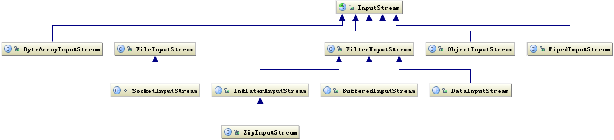
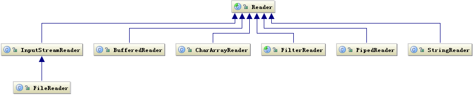

# IO

## 分类

Java的IO大致可以分为四类

* 面向字节流的IO：*InputStream*/*OutputStream*

* 面向字符操作的IO：*Reader*/*Writer*

* 文件操作的IO：*File*

* 网络IO：*Socket*

# InputStream/OutputStream

IO包中，XxxStream格式的类都是基于字节流的类

有两个很重要的面向字节流的类：*InputStream*和*OutputStream*

## 类结构

InputStream的类层次结构：



OutputStream的类层次结构：


然后看一下它们的类结构：

*InputStream*


*OutputStream*


## 要点

这俩IO类的操作方式都是可以组合操作的：

```java
    OutputStream out = 
                new BufferedOutputStream(
                        new ObjectOutputStream(
                                new FileOutputStream("???")));
```

不过最后要指定最终要写的地方（对于输入来说就是指定从哪输入），对于上面的声明来说就是写到文件中

这里很明显是一个装饰器模式

## 分类

这一块要结合着前面的类层次结构图来看

#### 基本的介质流

* *ByteArrayInputStream*、*FileInputStream*

* *ByteArrayOutputStream*、*FileOutputStream*

这些类的作用是从Byte数组、文件中获取输入/输出流

可以参看上面声明一个OutputStream的代码，最终提供输出的是*FileOutputStream*

#### 装饰流

* *ObjectInputStream*、*FilterInputStream*的子类

* *ObjectOutputStream*、*FilterOutputStream*的子类

可以参看上面声明一个*OutputStream*的代码，一层套一层的类都是上面这里的类

#### 管道

* *PipedInputStream*、*PipedOutputStream*

这俩要配合使用，用于从与其它线程共用的管道中读取/写入数据

# Reader/Writer

IO包中，XxxReader/XxxWriterer格式的类都是基于字符流的类

## 类结构

Reader的类层次结构及方法：




Writer的类层次结构和方法：


可以看到相对于Stream，这边的方法参数都是*int*、*char*、*String*

