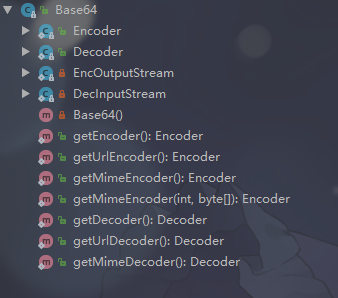

# JDK 8

是2014年发布的

**这里仅仅列出一些常见的新特性**

# Lambda表达式

Lambda表达式也叫闭包

Lambda表达式使函数作为方法的参数，使得代码更加简洁

最简单的，比如JDK8之前：

```java
    public static void main(String[] args) {

        new Thread() {
            @Override
            public void run() {
                System.out.println("Hello World");
            }
        }.start();
    }
```

而使用Lambda表达式简化之后：

```java
    public static void main(String[] args) {

        new Thread(() -> System.out.println("Hello World")).start();
    }
```

# 函数式接口

函数式接口是指有且仅有一个抽象方法的接口

常见的函数式接口比如有：

* java.lang.Runnable
* java.util.concurrent.Callable
* java.util.Comparator
* java.lang.reflect.InvocationHandler
* ……

函数式接口可以被隐式转换为lambda表达式，可以使得代码更加简洁

# 接口的默认方法、静态方法

JDK8中，接口可以写默认方法和静态方法

默认方法允许我们在接口里添加新的方法，而不会破坏已经实现这个接口的类的兼容性，换句话说就是实现接口的类不必重写默认方法

```java
interface I {
   default void defaultMethod(){
      System.out.println("Default Method");
   }
    
   static void staticMethod(){
      System.out.println("Static Method");
   }
}
```

静态方法的话，现在可以这样调用，就像调用普通类的静态方法一样

```java
    I.staticMethod();
```

# 重复注解

JDK5开始存在的注解在JDK8中同一个地方可以上多个注解

# 对Base64的支持

JDK8中Base64编码已经成为Java类库的标准，也提供了一个Base64类



# 时间API

你妈喊你回家填坑啦

# Stream

你妈喊你回家填坑啦

# JVM新特性

移除掉PermGen空间，替代的是Metaspace

JVM选项-XX:PermSize与-XX:MaxPermSize分别被-XX:MetaSpaceSize与-XX:MaxMetaspaceSize代替