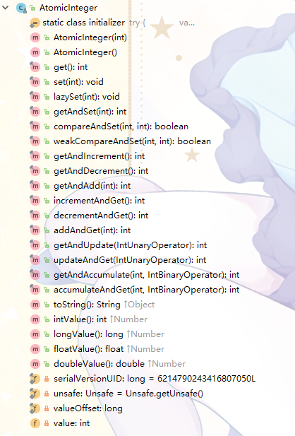
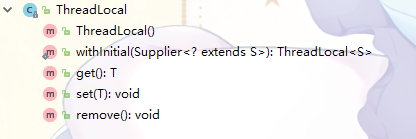
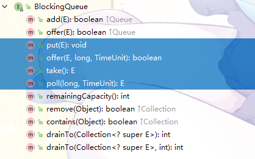

# 原子类

原子类是JUC的*atomic*包里提供的一组类，它能在保证性能的前提下对这个变量的操作是线程安全的

原子类一共有四种：基本类型类、数组类、引用类、字段类

原子类都是使用CAS实现原子操作，换一种方式说，原子类都是使用Unsafe实现的

## 原子更新基本类型类

这里包含了3类：

AtomicInteger

AtomicLong

AtomicBoolean

基本类型类提供了对基本类型变量的包装操作

因为都差不多，拿已经被讲烂的*AtomicInteger*作为例子



*AtomicInteger*的本体

```java
    private volatile int value;
```

可以看到使用了*volatile*来保证可见性

首先是get和set：

```java
    public final int get() {
        return value;
    }

    public final void set(int newValue) {
        value = newValue;
    }
```

这里并没有使用CAS，而是直接获取和更新，接下来

```java
    public final boolean compareAndSet(int expect, int update) {
        return unsafe.compareAndSwapInt(this, valueOffset, expect, update);
    }

    public final int getAndIncrement() {
        return unsafe.getAndAddInt(this, valueOffset, 1);
    }
```

这里的操作都是使用了CAS，也可以看到*AtomicInteger*直接调用了*Unsafe*里的方法，正如前面所说，原子类基本都是使用*Unsafe*实现CAS操作

#### 其他类型

一个问题，基本类型的原子类只有*Integer*、*Long*、*Boolean*三种，为什么呢？

仔细看下*AtomicInteger*里面的代码，会发现所有的CAS操作调用到最后都会调用*compareAndSwapInt*方法

再看下*Unsafe*的代码：

```java
    public final native boolean compareAndSwapObject(Object var1, long var2, Object var4, Object var5);

    public final native boolean compareAndSwapInt(Object var1, long var2, int var4, int var5);

    public final native boolean compareAndSwapLong(Object var1, long var2, long var4, long var6);
```

会发现*Unsafe*只提供这仨方法，也就是支持对*Integer*、*Long*、*Object*的操作

去看一下*AtomicLong*，CAS操作最后调用的都是*compareAndSwapLong*方法，这也符合了预期

*AtomicBoolean*呢？

```java
    public final boolean compareAndSet(boolean expect, boolean update) {
        int e = expect ? 1 : 0;
        int u = update ? 1 : 0;
        return unsafe.compareAndSwapInt(this, valueOffset, e, u);
    }
```

*AtomicBoolean*是先把*boolean*转换为*int*，然后调用的*compareAndSwapInt*方法实现CAS

所以Java没有提供其他类型的原子类也情有可原，不过个人觉得*char*也可以用类似思路实现原子类

# ThreadLocal

*ThreadLocal*可以看作是一种特殊的变量。每个线程都会持有这个变量的一个副本。或者说这个变量是线程隔离的。

如果说为了同步而加锁，这个是以时间换空间的话。那么*ThreadLocal*就是以空间换时间。

## demo

```java
public class Test {

    private static ThreadLocal<Integer> v = new ThreadLocal<>();

    public static void main(String[] args) throws InterruptedException {
        /*
            第一个线程将v置1，sleep一秒之后打印v
        */
        new Thread(() -> {
            v.set(1);
            try {
                Thread.sleep(1000);
            } catch (InterruptedException e) {
                e.printStackTrace();
            }
            System.out.println(v.get());
        }).start();

        Thread.sleep(50);   // 为了保证第一个线程先执行set方法，这里小睡一会

        /*
            第二个线程将v置1，sleep一百毫秒之后打印v
        */
        new Thread(() -> {
            v.set(2);
            try {
                Thread.sleep(100);
            } catch (InterruptedException e) {
                e.printStackTrace();
            }
            System.out.println(v.get());
        }).start();
    }
}
```

上面的代码输出永远是：
```
2
1
```

## 深入

其实第一次看*ThreadLocal*的源码时，还是挺迷糊的。因为一旦深入进去，就会有仨类的关系对于刚深入的我来说剪不断理还乱：*ThreadLocal*、*ThreadLocalMap*、*Thread*

在这里先稍微理一下它们仨的关系：

* *ThreadLocalMap*是*ThreadLocal*类里面的一个静态内部类

* *Thread*类中有一个*ThreadLocalMap*的成员变量*threadLocals*

* 顾名思义，*ThreadLocalMap*保存了*ThreadLocal*的一个集合，而且是以*ThreadLocal*的对象为key，value是使用者存进去的值

* 从上面几点其实可以看得出，*Thread*用一个*threadLocals*变量保存了*ThreadLocal*-value的一个Map集合

可能还有点懵，接下去继续

## get和set



先看一下*ThreadLocal*里面的公共方法，其实并不多。这里分别追踪一下*set(T value)*和*get()*

#### set

```java
    public void set(T value) {
        // 首先是获取当前的线程
        Thread t = Thread.currentThread();
        // 从线程中获取ThreadLocalMap，它就是Thread里的一个成员变量
        ThreadLocalMap map = getMap(t);
        // map已经有了就直接set
        if (map != null)
            map.set(this, value);
        // 没有就create一个
        else
            createMap(t, value);
    }

    // 可以看到getMap其实就是返回了Thread里的threadLocals变量
    ThreadLocalMap getMap(Thread t) {
        return t.threadLocals;
    }
```

*Thread*类里面的成员变量*threadLocals*↓↓↓

```java
    /* ThreadLocal values pertaining to this thread. This map is maintained
     * by the ThreadLocal class. */
    ThreadLocal.ThreadLocalMap threadLocals = null;
```

set方法首先从当前线程获取到*ThreadLocalMap*，然后再对这个Map进行set操作。可以看到set的时候，是以当前的这个*ThreadLocal*对象作为key的

如果Map没有初始化的话，就要调用*createMap(Thread t, T firstValue)*：

```java
    void createMap(Thread t, T firstValue) {
        t.threadLocals = new ThreadLocalMap(this, firstValue);
    }
```

嗯……就是单纯的new一个，然后顺便把值set进去

#### get

```java
    public T get() {
        /*
            和set一样先获取到当前线程的ThreadLocalMap
        */
        Thread t = Thread.currentThread();
        ThreadLocalMap map = getMap(t);

        if (map != null) {
            // map的get操作
            ThreadLocalMap.Entry e = map.getEntry(this);
            // 找到了要的东西就return回去
            if (e != null) {
                @SuppressWarnings("unchecked")
                T result = (T)e.value;
                return result;
            }
        }
        // map还未初始化or找不到对应的Entry的时候调用了一个方法进行返回
        return setInitialValue();
    }
```

get的逻辑也不复杂，有一个值得注意的地方就是Map还未初始化or找不到对应的Entry的时候调用了*setInitialValue()*。追进去

```java
    private T setInitialValue() {
        /*
            首先从initialValue方法里获取初始值
        */
        T value = initialValue();
        /*
            从这里开始其实就是一个set操作了
            可以对比一下上边的set(T value)方法，基本上是一样一样的
            这里把从initialValue方法里获取的初值set进去了
        */
        Thread t = Thread.currentThread();
        ThreadLocalMap map = getMap(t);
        if (map != null)
            map.set(this, value);
        else
            createMap(t, value);
        /*
            将初始值返回
        */
        return value;
    }

    /*
        返回一个初始值，默认的初始值是null
        可以看到，这个方法是protect的
    */
    protected T initialValue() {
        return null;
    }
```

*setInitialValue()* 首先从*initialValue()* 里获取了一个初值，然后set进Map里，最后再把初值返回

值得注意的是，*initialValue()*默认是返回了一个null。某些情况下会导致 *NullPointerException*

但是也能看到*initialValue()* 是一个*protect*方法，也就是说**我们可以通过重写这个方法自定义一个初始值**

## ？？？

之前说过，*ThreadLocal*可以看作是一种特殊的变量。每个线程都会持有这个变量的一个副本

实际上，是因为*Thread*用一个*threadLocals*变量保存了一个Map集合，以*ThreadLocal*对象作为key。一个*ThreadLocal*对象，每个线程访问，向它保存、取出值的时候，都是把它作为key保存到自己的Map里，Map是每个线程之间隔离的。这样，实现了每个线程都有*ThreadLocal*变量的一个副本

# 阻塞队列

阻塞队列是支持了两个附加操作的队列。这两个附加操作是指阻塞的添加和移除方法

阻塞添加：队列满时，队列会阻塞插入元素的线程，直到队列不满

阻塞移除：队列空时，队列会阻塞移除元素的线程，直到队列不空

这是附加操作的一些方法：

| 方法 | 丢异常 | 返回特殊值 | 阻塞 | 超时退出 |
| ---: | ---: | ---: | ---: | ---: | 
| 插 | add(e) | offer(e) | put(e) | offer(e, time, unit) |
| 删 | remove() | poll() | take() | poll(time, unit) |

## BlockingQueue

*BlockingQueue*接口直接继承于*Queue*接口，是所有阻塞队列的父类



*BlockingQueue*接口新增了四个方法，这是个方法也是主要实现阻塞队列性质的方法

---

简单说几个阻塞队列吧

## ArrayBlockingQueue

一个用数组实现的有界阻塞队列，按FIFO原则对元素进行排序

本体↓↓↓

```java
    /** The queued items */
    final Object[] items;
```

*ArrayBlockingQueue*的阻塞操作依靠了*Lock*和*Condition*

```java
    /** Main lock guarding all access */
    final ReentrantLock lock;

    /** Condition for waiting takes */
    private final Condition notEmpty;

    /** Condition for waiting puts */
    private final Condition notFull;
```

#### 阻塞操作

阻塞操作使用通知模式实现

当生产者往满的队列添加元素时会阻塞，消费者消费了队列中的元素之后，会通知生产者队列可用。反之亦然，消费者消费空的队列时会阻塞，生产者往队列添加元素后会通知消费者。

先来看看*put(E)*方法

```java
    public void put(E e) throws InterruptedException {
        checkNotNull(e);
        final ReentrantLock lock = this.lock;
        // 加可中断锁
        lock.lockInterruptibly();
        try {
            // 可以看到，这里当队列满的时候，会调用await()阻塞线程
            while (count == items.length)
                notFull.await();
            // 线程被唤醒并且队列不满就把元素入队
            enqueue(e);
        } finally {
            lock.unlock();
        }
    }

    private void enqueue(E x) {
        final Object[] items = this.items;
        items[putIndex] = x;
        // putIndex到头了就置零从头来（循环队列）
        if (++putIndex == items.length)
            putIndex = 0;
        count++;
        // 这里唤醒了阻塞的获取元素的线程（如果有的话）
        notEmpty.signal();
    }
```

再看看*take()*方法

```java
    public E take() throws InterruptedException {
        final ReentrantLock lock = this.lock;
        // 依旧是加可中断锁
        lock.lockInterruptibly();
        try {
            // 可以看到，这里当队列空的时候，会调用await()阻塞线程
            while (count == 0)
                notEmpty.await();   // 这次是notEmpty的await()方法
            // 线程被唤醒并且队列不空元素出队
            return dequeue();
        } finally {
            lock.unlock();
        }
    }

    private E dequeue() {
        final Object[] items = this.items;
        @SuppressWarnings("unchecked")
        E x = (E) items[takeIndex];
        items[takeIndex] = null;
        // takeIndex到头了也置零从头来
        if (++takeIndex == items.length)
            takeIndex = 0;
        count--;
        if (itrs != null)
            itrs.elementDequeued();
        // 这里也同样唤醒了阻塞的添加元素的线程（如果有的话）    
        notFull.signal();
        return x;
    }
```

put和take的逻辑都是差不多的。可以看到，*notEmpty*和*notFull*在方法中的使用，依靠它们来实现线程之间的交流和阻塞控制

*ArrayBlockingQueue*的这俩方法可以当成*Condition*使用的一个demo来学习

#### 超时退出

*BlockingQueue*的*offer(e, time, unit)* 和*poll(time, unit)*实现了阻塞的超时退出

先看看offer：

```java
    public boolean offer(E e, long timeout, TimeUnit unit)
        throws InterruptedException {

        checkNotNull(e);
        // 转成纳秒
        long nanos = unit.toNanos(timeout);
        final ReentrantLock lock = this.lock;
        lock.lockInterruptibly();
        try {
            while (count == items.length) {
                if (nanos <= 0)
                    return false;
                // 这个方法会返回剩余的超时时间
                // 超时时间<0表明已经超时了
                nanos = notFull.awaitNanos(nanos);
            }
            enqueue(e);
            return true;
        } finally {
            lock.unlock();
        }
    }
```

还有poll：

```java
    public E poll(long timeout, TimeUnit unit) throws InterruptedException {
        long nanos = unit.toNanos(timeout);
        final ReentrantLock lock = this.lock;
        lock.lockInterruptibly();
        try {
            while (count == 0) {
                if (nanos <= 0)
                    return null;
                nanos = notEmpty.awaitNanos(nanos);
            }
            return dequeue();
        } finally {
            lock.unlock();
        }
    }
```

可以看到这俩方法和前面的put和take基本上没有太大区别。不过是在while循环中，使用了*awaitNanos(long)*更新超时时间，并增加了一个超时判断

总的来说*ArrayBlockingQueue*最核心的几个方法还是不难的

## LinkedBlockingQueue

一个用链表实现的有界阻塞队列，按FIFO原则对元素进行排序，最大长度为*Integer.MAX_VALUE*

## PriorityBlockingQueue

一个支持优先级的无界阻塞队列，默认采用升序排列

## DelayQueue

一个支持延时获取元素的无界阻塞队列，底层队列使用*PriorityBlockingQueue*实现

队列元素需要实现*Delayed*接口。创建元素时指定多久才能从队列中获取元素

## SynchronousQueue

一个不存储元素的队列，每一个put操作必须等待一个take操作

这个队列很适合传递性场景，生产者线程直接把数据传递给消费者线程

## LinkedTransferQueue

一个用链表结构实现的无界阻塞队列
