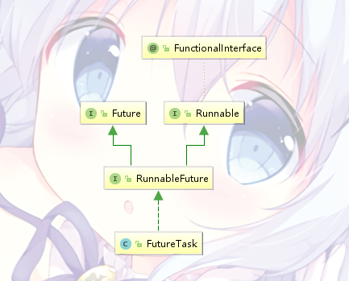

# 线程

现代操作系统调度的最小单位是线程，也是CPU调度和分派的基本单位

一个进程里可以创建多个线程，线程有各自独立的计数器、堆栈和局部变量等

## 线程的状态

| 状态 | 说明 |
| --- | --- | 
| NEW | 初始状态，线程被构建，但还没有运行（调用*start()*）|
| RUNNABLE | 运行状态，Java线程中，这种状态包括了操作系统的**就绪态**和**运行态** |
| BLOCKED | 阻塞状态，线程被锁阻塞 |
| WAITING | 等待状态，当前线程正在等待其他线程中断或者通知 |
| TIME_WAITING | 超时等待状态，和WAITING态的区别就是它会在指定之间后自行返回 |
| TERMINATED | 终止状态，这线程已经跑完了 |

# Thread

通过继承*Thread*类来创建一个新线程

*Thread*也是Java中很关键的一个类

标准用法↓↓↓

```java
public class Test {

    public static void main(String[] args) {
        T t = new T();
        t.start();
    }
}

class T extends Thread {

    @Override
    public void run() {
        System.out.println("Hello World");
    }
}
```

也可以这样子 

```java
public class Test {

    public static void main(String[] args) {
        new Thread() {
            @Override
            public void run() {
                System.out.println("Hello");
                System.out.println("World");
            }
        }.start();
    }

    /*
        jdk8中可以使用lambda
    */
    public static void main(String[] args) {
        new Thread(() -> {
            System.out.println("Hello");
            System.out.println("World");
        }).start();
    }
}
```

还可以给线程起名字

```java
public class Test {

    public static void main(String[] args) {
        T t = new T("Test Thread");
        t.start();
    }
}

class T extends Thread {

    public T(String name) {
        super(name);
    }

    @Override
    public void run() {
        System.out.println("[" + Thread.currentThread().getName() + "] - Hello World");
    }
}
```

# Runnable

通过实现*Runnable*接口来新建一个线程，这种方法比继承*Thread*要来得灵活——Java只能继承一个父类，但是可以实现多个接口 

（顺带一提*Thread*也实现了*Runnable*接口

标准操作：

```java
public class Test {

    public static void main(String[] args) {
        T t = new T();
        
        Thread thread = new Thread(t, "Test Thread");
        thread.start();
    }
}

class T implements Runnable {

    @Override
    public void run() {
        System.out.println("[" + Thread.currentThread().getName() + "] - Hello World");
    }
}
```

并且，*Runnable*是一个函数式接口：

```java
@FunctionalInterface
public interface Runnable {
    public abstract void run();
}
```

# Callable&Future

*Runnable*创建的线程是不能有返回值的，但是*Callable*可以有

*Callable*也是一个函数式接口：

```java
@FunctionalInterface
public interface Callable<V> {
    V call() throws Exception;
}
```

*Callable*创建的线程要使用*Future*来获取返回的结果，同时它也能查看线程任务状态or取消任务。*Future*也是一个接口：

```java
public interface Future<V> {

    /**
     * 尝试取消当前的线程任务
     * 如果任务已经完成或还没开始，直接返回false
     * 如果任务进行中，mayInterruptIfRunning参数决定是否中断正在执行的任务。如果取消失败，返回false
    boolean cancel(boolean mayInterruptIfRunning);

    /**
     * 当任务在完成之前被取消返回true
     */
    boolean isCancelled();

    /**
     * 任务正常完成返回true
     */
    boolean isDone();

    /**
     * 这个方法会获取线程任务执行得到的结果，如果任务没有结束，这个方法会一直阻塞
     */
    V get() throws InterruptedException, ExecutionException;

    /**
     * 这个方法会获取线程任务执行得到的结果，如果任务没有结束，这个方法会一直阻塞到超时为止
     */
    V get(long timeout, TimeUnit unit)
        throws InterruptedException, ExecutionException, TimeoutException;
}
```

*Callable*和*Future*最简单的使用是这样：

```java
public class Test {

    public static void main(String[] args) throws ExecutionException, InterruptedException {
        C c = new C();
        FutureTask<Integer> task = new FutureTask<>(c);

        Thread thread = new Thread(task);
        thread.start();
        
        int r = task.get();
        System.out.println(r);
    }
}

class C implements Callable<Integer> {

    @Override
    public Integer call() {
        return 1 + 1;
    }
}
```

当然，大部分情况下是配合线程池使用：

```java
public class Test {

    public static void main(String[] args) throws ExecutionException, InterruptedException {
        ExecutorService pool = Executors.newSingleThreadExecutor();

        C c = new C();
        Future<Integer> future = pool.submit(c);

        int r = future.get();
        System.out.println(r);

        pool.shutdown();
    }

    /*
        使用FutureTask会更好些
    */
    public static void main(String[] args) throws ExecutionException, InterruptedException {
        ExecutorService pool = Executors.newSingleThreadExecutor();

        C c = new C();
        FutureTask<Integer> task = new FutureTask<>(c);
        pool.submit(task);

        int r = task.get();
        System.out.println(r);

        pool.shutdown();
    }
}

class C implements Callable<Integer> {

    @Override
    public Integer call() throws InterruptedException {
        return 1 + 1;
    }
}
```

## FutureTask

刚才的3段代码中，会发现*FutureTask*既能和*Thread*打交道，又能和线程池搞在一起（*Thread*的构造方法只能接受Runnable*

看下FutureTask的类结构:



你会发现这货同时实现了*Runnable*和*Future*俩接口！

也就是说，*FutureTask*不但能接受Callable任务，还能把任务当成Runnale提交到*Thread*类or线程池中，之后还能从任务获取结果

其实*FutureTask*的构造方法也能接受一个Runnable，只不过还是会将它转成Callable

```java
    public FutureTask(Runnable runnable, V result) {
        this.callable = Executors.callable(runnable, result);
        this.state = NEW;       // ensure visibility of callable
    }

    public static <T> Callable<T> callable(Runnable task, T result) {
        if (task == null)
            throw new NullPointerException();
        return new RunnableAdapter<T>(task, result);
    }

    static final class RunnableAdapter<T> implements Callable<T> {
        final Runnable task;
        final T result;
        RunnableAdapter(Runnable task, T result) {
            this.task = task;
            this.result = result;
        }
        public T call() {
            task.run();
            return result;
        }
    }
```

# 线程交互

## wait/notify

*wait()*、*notify()*看着眼熟？因为它们是*Object*类里的方法：

```java
    public final native void notify();

    public final native void notifyAll();

    public final native void wait(long timeout) throws InterruptedException;

    public final void wait(long timeout, int nanos) throws InterruptedException {
        if (timeout < 0) {
            throw new IllegalArgumentException("timeout value is negative");
        }

        if (nanos < 0 || nanos > 999999) {
            throw new IllegalArgumentException(
                                "nanosecond timeout value out of range");
        }

        if (nanos > 0) {
            timeout++;
        }

        wait(timeout);
    }

    public final void wait() throws InterruptedException {
        wait(0);
    }
```

| 方法 | 说明 |
| --- | --- | 
| notify() | 随机通知一个在对象上等待的线程，如果该线程获取到了锁，则能从wait()方法返回 |
| notifyAdd() | 通知所有在该对象上等待的线程 |
| wait() | 调用此方法后的线程进入WAITING状态，释放对象的锁，直到其他线程的通知或者被中断 |
| wait(long) | 超时等待一段时间，这里时间单位是ms，若超时没有通知就返回 |
| wait(long, int) | 对于超时时间可以控制到ns |

#### demo 

打印ABCx10

```java
public class Test {

    public static Integer turn;

    public static void main(String[] args) {
        turn = 0;
        Object o = new Object();
        new Thread(new A(o), "Thread A").start();
        new Thread(new B(o), "Thread B").start();
        new Thread(new C(o), "Thread C").start();
    }

    static class A implements Runnable {

        final Object o;

        A(Object o) {
            this.o = o;
        }

        @Override
        public void run() {
            synchronized (o) {
                for (int i = 0; i < 10; ++i) {
                    while (turn != 0) {
                        try {
                            o.wait();
                        } catch (InterruptedException e) {
                            e.printStackTrace();
                        }
                    }
                    System.out.println("A");
                    turn = (turn + 1) % 3;
                    o.notifyAll();
                }
            }
        }
    }

    static class B implements Runnable {

        final Object o;

        B(Object o) {
            this.o = o;
        }

        @Override
        public void run() {
            synchronized (o) {
                for (int i = 0; i < 10; ++i) {
                    while (turn != 1) {
                        try {
                            o.wait();
                        } catch (InterruptedException e) {
                            e.printStackTrace();
                        }
                    }
                    System.out.println("B");
                    turn = (turn + 1) % 3;
                    o.notifyAll();
                }
            }
        }
    }

    static class C implements Runnable {

        final Object o;

        C(Object o) {
            this.o = o;
        }

        @Override
        public void run() {
            synchronized (o) {
                for (int i = 0; i < 10; ++i) {
                    while (turn != 2) {
                        try {
                            o.wait();
                        } catch (InterruptedException e) {
                            e.printStackTrace();
                        }
                    }
                    System.out.println("C");
                    turn = (turn + 1) % 3;
                    o.notifyAll();
                }
            }
        }
    }
}
```

*notify()*方法有个缺点，就是只能随机唤醒一个线程，因此demo中只能使用*notifyAll()*，万一随机唤醒错了，这仨线程就永远睡下去了

## join

*join()* 表示等待该线程完成

假设线程m调用了*t.join()*，那么m就会一直在这里等待直到线程t结束之后才继续进行

一个简单的例子：

```java
public class Test {

    public static void main(String[] args) throws ExecutionException, InterruptedException {
        Thread t = new Thread(new R());
        t.start();
        t.join();
        
        System.out.println("Work Complete");
    }

    static class R implements Runnable {
        @Override
        public void run() {
            System.out.println("Work Start");

            try {
                Thread.sleep(2000);
            } catch (InterruptedException e) {
                e.printStackTrace();
            }
        }
    }
}
```

同时，还有*join(long millis)*、*join(long millis, int nanos)*可以指定超时时间，如果过了超时时间线程还没有结束，调用线程将从方法中返回

## Condition/Lock

利用*Lock*的*Condition*来进行线程交互

*Condition*有两个方法：*await()*对应前面提到的*wait()*，*signal()*对应*notify()*

#### demo

继续以刚才的打印ABC作为demo

```java
public class Test {

    public static Integer turn;

    static Lock lock = new ReentrantLock();

    static Condition a = lock.newCondition();
    static Condition b = lock.newCondition();
    static Condition c = lock.newCondition();

    public static void main(String[] args) throws ExecutionException, InterruptedException {
        turn = 0;
        new Thread(new A(), "Thread A").start();
        new Thread(new B(), "Thread B").start();
        new Thread(new C(), "Thread C").start();
    }

    static class A implements Runnable {
        @Override
        public void run() {
            lock.lock();
            try {
                for (int i = 0; i < 10; ++i) {
                    while (turn != 0)
                        a.await();
                    System.out.println("A");
                    turn = (turn + 1) % 3;
                    b.signal();
                }
            } catch (InterruptedException e) {
                e.printStackTrace();
            } finally {
                lock.unlock();
            }
        }
    }

    static class B implements Runnable {
        @Override
        public void run() {
            lock.lock();
            try {
                for (int i = 0; i < 10; ++i) {
                    while (turn != 1)
                        b.await();
                    System.out.println("B");
                    turn = (turn + 1) % 3;
                    c.signal();
                }
            } catch (InterruptedException e) {
                e.printStackTrace();
            } finally {
                lock.unlock();
            }
        }
    }

    static class C implements Runnable {
        @Override
        public void run() {
            lock.lock();
            try {
                for (int i = 0; i < 10; ++i) {
                    while (turn != 2)
                        c.await();
                    System.out.println("C");
                    turn = (turn + 1) % 3;
                    a.signal();
                }
            } catch (InterruptedException e) {
                e.printStackTrace();
            } finally {
                lock.unlock();
            }
        }
    }
}
```

可以看到这里只需要唤醒指定的线程就可以了，不像之前还要担心随机唤醒