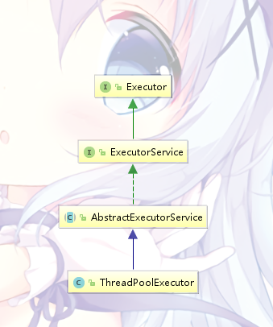

# 线程池

系统创建、销毁一个线程都需要消耗不少资源，线程池可以利用已创建的线程降低系统消耗。有新任务到达时，也不需要等待新线程的创建，可以马上执行

同时，使用线程池可以统一进行分配、调优和监控

# ThreadPoolExecutor

*ThreadPoolExecutor*是JUC里面的一个线程池类，它的类图：



## 参数

线程池中有几个很重要的参数，先看看它的构造方法：

```java
    public ThreadPoolExecutor(int corePoolSize,
                              int maximumPoolSize,
                              long keepAliveTime,
                              TimeUnit unit,
                              BlockingQueue<Runnable> workQueue,
                              ThreadFactory threadFactory,
                              RejectedExecutionHandler handler) {
        if (corePoolSize < 0 ||
            maximumPoolSize <= 0 ||
            maximumPoolSize < corePoolSize ||
            keepAliveTime < 0)
            throw new IllegalArgumentException();
        if (workQueue == null || threadFactory == null || handler == null)
            throw new NullPointerException();
        this.acc = System.getSecurityManager() == null ?
                null :
                AccessController.getContext();
        this.corePoolSize = corePoolSize;
        this.maximumPoolSize = maximumPoolSize;
        this.workQueue = workQueue;
        this.keepAliveTime = unit.toNanos(keepAliveTime);
        this.threadFactory = threadFactory;
        this.handler = handler;
    }
```

* corePoolSize：线程池的基本大小。若线程池的线程数小于它时，当有新任务提交时，即使线程池有空闲线程，也会创建线程，直到线程池的线程数打到这个值

* maximumPoolSize：线程池最大大小。线程池允许的最大线程数

* keepAliveTime：线程活动保持时间。线程池中的线程空闲后保持存活的时间

* workQueue：任务队列。用于保存等待执行的任务的阻塞队列，可以选择*ArrayBlockingQueue*、*LinkedBlockingQueue*、*SynchronousQueue*、*PriorityBockingQueue*

* threadFactory：创建线程的工厂。比如可以通过它给线程池创建出来的线程一些名字

* handler：饱和策略。阻塞队列和线程池都满的时候，如何拒绝提交的任务，有以下几种策略：

    | 策略 | 说明 |
    | --- | --- |   
    | AbortPolicy | 直接丢异常 |
    | CallerRunsPolicy | 用调用者所在线程来执行任务 |
    | DiscardOldestPolicy | 丢掉阻塞队列里最近的一个任务，执行当前这个 |
    | DiscradPolicy | 啥都不做直接丢弃 |

## 提交任务

向线程池提交任务可以参看上边**Callable&Future**那一节有关线程池的代码

下面看下*ThreadPoolExecutor*的提交方法：

```java
    public Future<?> submit(Runnable task) {
        if (task == null) throw new NullPointerException();
        RunnableFuture<Void> ftask = newTaskFor(task, null);
        execute(ftask);
        return ftask;
    }

    public <T> Future<T> submit(Runnable task, T result) {
        if (task == null) throw new NullPointerException();
        RunnableFuture<T> ftask = newTaskFor(task, result);
        execute(ftask);
        return ftask;
    }

    public <T> Future<T> submit(Callable<T> task) {
        if (task == null) throw new NullPointerException();
        RunnableFuture<T> ftask = newTaskFor(task);
        execute(ftask);
        return ftask;
    }
```

非常整齐划一的仨方法，*RunnableFuture*在前面*FutureTask*已经出现过了，跟踪进去，上面调用了俩个重载的方法：

```java
    protected <T> RunnableFuture<T> newTaskFor(Runnable runnable, T value) {
        return new FutureTask<T>(runnable, value);
    }

    protected <T> RunnableFuture<T> newTaskFor(Callable<T> callable) {
        return new FutureTask<T>(callable);
    }
```

第二个不用说了，第一个方法前面也刚刚写完

看到这里大致知道了*ThreadPoolExecutor*都是把任务当成*RunnableFuture*执行的

## 关闭

关闭线程池有两个方法： 

```java

    /**
     * 这个方法会等待任务执行完，同时不能再向线程池提交任务
     */
    public void shutdown();

    /**
     * 这个方法会立即关闭线程池
     */
    public List<Runnable> shutdownNow();
```

## ctl

```java
    private final AtomicInteger ctl = new AtomicInteger(ctlOf(RUNNING, 0));
```

*ctl*是*ThreadPoolExecutor*里的一个核心控制字段，它保存了线程池的状态和工作线程的数量。它也使用了原子类保证操作的时候的线程安全

#### 结构

~~*ctl*作为一个int类型的字段，有32位的字长~~

分为两部分：低29位用于记录工作线程数，高3位用于保存线程池状态

因此，*ThreadPoolExecutor*最大线程数为2^29-1。同时，因为是使用低29位保存计数，因此可以很方便的加加减减

#### 线程池的状态

源代码的字段里其实已经把线程池的各种状态明确的列了出来：

```java
    private static final int COUNT_BITS = Integer.SIZE - 3;

    private static final int RUNNING    = -1 << COUNT_BITS;
    private static final int SHUTDOWN   =  0 << COUNT_BITS;
    private static final int STOP       =  1 << COUNT_BITS;
    private static final int TIDYING    =  2 << COUNT_BITS;
    private static final int TERMINATED =  3 << COUNT_BITS;
```

为了方便阅读，翻译过来就是（全部省略了后面跟着28个0，懒得打字）
```
    1010    RUNNING
    0000    SHUTDOWN
    0010    STOP
    0100    TIDYING
    0110    TERMINATED
```

#### ctl的一些操作

```java
    // 高3位 = 0，低29位 = 1
    private static final int CAPACITY   = (1 << COUNT_BITS) - 1;

    // 获取工作状态
    private static int runStateOf(int c)     { return c & ~CAPACITY; }
    
    // 获取工作线程数
    private static int workerCountOf(int c)  { return c & CAPACITY; }
    
    private static int ctlOf(int rs, int wc) { return rs | wc; }

    private static boolean isRunning(int c) {
        return c < SHUTDOWN;
    }

    // CAS增加一个工作线程
    private boolean compareAndIncrementWorkerCount(int expect) {
        return ctl.compareAndSet(expect, expect + 1);
    }

    // CAS减少一个工作线程
    private boolean compareAndDecrementWorkerCount(int expect) {
        return ctl.compareAndSet(expect, expect - 1);
    }

    // 减少一个工作线程
    private void decrementWorkerCount() {
        do {} while (! compareAndDecrementWorkerCount(ctl.get()));
    }
```


## 任务的执行

#### 大致流程

这里开始稍微深入下*ThreadPoolExecutor*是怎么处理一个提交的任务的

    1.先判断核心池线程的数量是否大等于*corePoolSize*。如果没有，则创建一个线程去执行任务，否则下个步骤

    2.判断工作队列*workQueue*是否已满，如果队列没有满的话，就把任务放入队列中，否则下个步骤

    3.判断线程池的线程数量是否达到*maximumPoolSize*。如果没有，则创建一个新的工作线程执行任务，否则进行饱和处理（根据饱和策略）

这便是*ThreadPoolExecutor*大致工作流程，之前讲提交任务的时候不是漏了分析*execute*方法吗？现在补上

#### execute

```java
    public void execute(Runnable command) {
        if (command == null)
            throw new NullPointerException();

        // 获取线程池的控制字段    
        int c = ctl.get();
        // 如果当前的工作线程数小于基本线程数，新建新的核心池线程
        if (workerCountOf(c) < corePoolSize) {
            if (addWorker(command, true))
                return;
            // 如果新建核心线程失败，再次获取控制字段
            c = ctl.get();
        }

        // 工作线程已经大于corePoolSize，此时尝试添加任务到工作队列
        if (isRunning(c) && workQueue.offer(command)) {
            int recheck = ctl.get();    // 再次获取线程池状态
            // double-check，如果线程池被关闭，将任务从工作队列移除，执行拒绝策略
            if (! isRunning(recheck) && remove(command))
                reject(command);
            // 检查工作线程是不是变为0了，往非核心池增加一个null任务
            else if (workerCountOf(recheck) == 0)
                addWorker(null, false);
        }
        // 如果任务队列也满了，尝试在非核心池新建线程执行，如果工作线程达到了maximumPoolSize，执行拒绝策略
        else if (!addWorker(command, false))
            reject(command);
    }
```

可以发现*execute(Runnable command)*方法的大致流程已经和刚才列出的步骤差不多了

#### addWorker

一路下来，*addWorker*方法是难以一眼看出做了些什么工作的，进去看看

```java
    private boolean addWorker(Runnable firstTask, boolean core) {
        /*
            这里是设置ctl
        */
        retry:
        for (;;) {
            // 获取运行状态
            int c = ctl.get();
            int rs = runStateOf(c);

            // 这一节注释来自 https://www.imooc.com/article/42990 （实在看不懂这段判断
            // 如果线程池已关闭，并满足以下条件之一，那么不创建新的 worker： 
            // 1. 线程池状态大于 SHUTDOWN，也就是 STOP, TIDYING, 或 TERMINATED 
            // 2. firstTask != null 
            // 3. workQueue.isEmpty()
            if (rs >= SHUTDOWN &&
                ! (rs == SHUTDOWN && firstTask == null && ! workQueue.isEmpty()))
                return false;

            for (;;) {
                int wc = workerCountOf(c);  // 获取线程数
                // 超过阈值丢false回去，可以发现这里core的作用是判断增加的是核心线程还是普通线程
                if (wc >= CAPACITY ||
                    wc >= (core ? corePoolSize : maximumPoolSize))
                    return false;
                // 工作线程数+1
                if (compareAndIncrementWorkerCount(c))
                    break retry;
                // 重新读取工作状态
                c = ctl.get(); 
                // 如果不一样说明工作状态被其他线程修改了，从头开始，不然就只需要重新这个内部的小循环
                if (runStateOf(c) != rs)
                    continue retry;
            }
        }

        /*
            这里开始就可以增加新的worker
        */
        boolean workerStarted = false;
        boolean workerAdded = false;
        Worker w = null;
        try {
            // 新建一个Worker
            w = new Worker(firstTask);
            // 获取worker的线程
            final Thread t = w.thread;
            if (t != null) {
                final ReentrantLock mainLock = this.mainLock;
                // 加锁
                mainLock.lock();
                try {
                    // 再次获取线程池状态
                    int rs = runStateOf(ctl.get());
                    // 如果线程池没有停止，或者停止了并且firstTask为空
                    if (rs < SHUTDOWN ||
                        (rs == SHUTDOWN && firstTask == null)) {
                        // 先判断线程是可用的
                        if (t.isAlive()) // precheck that t is startable
                            throw new IllegalThreadStateException();
                        // 将创建的worker添加到worker集合中
                        workers.add(w);
                        // 更新largestPoolSize
                        int s = workers.size();
                        if (s > largestPoolSize)
                            largestPoolSize = s;
                        workerAdded = true;
                    }
                } finally {
                    // 解锁
                    mainLock.unlock();
                }
                // worker添加成功，启动线程
                if (workerAdded) {
                    t.start();
                    workerStarted = true;
                }
            }
        } finally {
            // 这边是添加worker失败的处理
            if (! workerStarted)
                addWorkerFailed(w);
        }
        return workerStarted;
    }


    private void addWorkerFailed(Worker w) {
        final ReentrantLock mainLock = this.mainLock;
        mainLock.lock();
        try {
            if (w != null)
                workers.remove(w);  // 从集合中移除刚刚添加失败的worker
            decrementWorkerCount(); // 工作线程数-1
            tryTerminate();
        } finally {
            mainLock.unlock();
        }
    }
```

这个方法的确贼麻烦的，至少换现在的自己绝对写不出这种代码吧

一路下来，大致的思路是先改变*ctl*，在上边增加一个工作线程数，随后是新建一个新的*Worker*，并且启动线程。中间穿插许多校验和状态判断，如果失败还要回滚

## Worker

*Worker*是*ThreadPoolExecutor*里面的一个内部类，*ThreadPoolExecutor*把工作线程包装成了一个个*Worker*，存放在一个*HashSet*中

```java
    private final HashSet<Worker> workers = new HashSet<Worker>();
```

*Worker*继承了*Runnable*，并且使用了AQS

#### Worker的执行

接下来继续上边代码的步骤，看下*Worker*启动之后：

```java
    public void run() {
        runWorker(this);
    }
```

这里的*runWorker*不是*Worker*自身的方法，而是*ThreadPoolExecutor*里的

```java
    final void runWorker(Worker w) {
        // 获取当前线程
        Thread wt = Thread.currentThread();
        // 这个是Worker的初始任务
        Runnable task = w.firstTask;
        w.firstTask = null;
        w.unlock(); 
        // 这个变量是用来记录Worker是不是因为异常而gg
        boolean completedAbruptly = true;
        try {
            /*
                从这个循环开始Worker会不断的从队列获取任务执行
            */
            while (task != null || (task = getTask()) != null) {
                w.lock();
                // 如果线程池停止，确保线程中断，否则确保线程不中断
                // 第二种情况要二次检查，确保清理中断的时候同时处理shutdownNow竞争
                if ((runStateAtLeast(ctl.get(), STOP) ||
                     (Thread.interrupted() &&
                      runStateAtLeast(ctl.get(), STOP))) &&
                    !wt.isInterrupted())    // 上面这段是直译源码的注释，然而并不懂
                    wt.interrupt();
                try {
                    // 执行运行任务前的前置处理
                    beforeExecute(wt, task);
                    Throwable thrown = null;
                    try {
                        task.run(); //执行任务
                    } catch (RuntimeException x) {
                        thrown = x; throw x;
                    } catch (Error x) {
                        thrown = x; throw x;
                    } catch (Throwable x) {
                        thrown = x; throw new Error(x);
                    } finally {
                        // 执行运行任务后的后置处理
                        afterExecute(task, thrown);
                    }
                } finally {
                    task = null;
                    w.completedTasks++;
                    w.unlock();
                }
                // 这个流程结束之后回到while继续获取任务执行
            }
            completedAbruptly = false;  //如果从循环出来到这里，是正常退出
        } finally {
            // Worker退出的方法
            processWorkerExit(w, completedAbruptly);
        }
    }
```

看到这里对线程池的工作方式已经开始明了了，继续while语句里的*getTask()*

```java
    private Runnable getTask() {
        boolean timedOut = false; // Did the last poll() time out?

        for (;;) {
            // 获取线程池状态
            int c = ctl.get();
            int rs = runStateOf(c);

            // 如果线程停止或者可以停止，返回null并且工作线程数-1
            if (rs >= SHUTDOWN && (rs >= STOP || workQueue.isEmpty())) {
                decrementWorkerCount();
                return null;
            }

            int wc = workerCountOf(c);

            // 判断workers有没有超时时间
            boolean timed = allowCoreThreadTimeOut || wc > corePoolSize;

            // 如果工作线程数>1或者工作队列为空，
            // 并且工作线程数>maximumPoolSize或者已经超时了
            // 要移除这个worker并且返回null
            if ((wc > maximumPoolSize || (timed && timedOut))
                && (wc > 1 || workQueue.isEmpty())) {
                if (compareAndDecrementWorkerCount(c))
                    return null;
                continue;
            }

            try {
                // 根据有没有超时限制，来从阻塞队列获取任务
                Runnable r = timed ?
                    workQueue.poll(keepAliveTime, TimeUnit.NANOSECONDS) :
                    workQueue.take();
                // 正常获取到任务，返回
                if (r != null)
                    return r;
                // 超时了
                timedOut = true;
            } catch (InterruptedException retry) {
                timedOut = false;
            }
        }
    }
```

*getTask()*这个方法就是从任务队列获取任务，同时兼带判断超时、worker的移除等

#### 最后

至此，*ThreadPoolExecutor*的内部机制已经大致明白了

添加任务的流程就和上边说的一样，然后线程池里头其实是一个个*Worker*在不断的执行任务
通过*getTask()*不断的获取任务

*getTask()*除了从任务队列获取提供任务之外，还负责*Worker*的管理，比如超时之后的移除，超过核心池*corePoolSize*大小之后的处理等

# Executor

## 结构

#### 任务

通常我们新建线程所需要实现的接口：**Runnable**、**Callable**

#### 任务执行

最顶级的**Exexutor**接口：

```java
public interface Executor {

    void execute(Runnable command);
}
```

继承了它的**ExecutorService**接口：

```java
public interface ExecutorService extends Executor {

    void shutdown();

    List<Runnable> shutdownNow();

    boolean isShutdown();

    boolean isTerminated();

    boolean awaitTermination(long timeout, TimeUnit unit)
        throws InterruptedException;

    <T> Future<T> submit(Callable<T> task);

    <T> Future<T> submit(Runnable task, T result);

    Future<?> submit(Runnable task);

    <T> List<Future<T>> invokeAll(Collection<? extends Callable<T>> tasks)
        throws InterruptedException;

    <T> List<Future<T>> invokeAll(Collection<? extends Callable<T>> tasks,
                                  long timeout, TimeUnit unit)
        throws InterruptedException;

    <T> T invokeAny(Collection<? extends Callable<T>> tasks)
        throws InterruptedException, ExecutionException;

    <T> T invokeAny(Collection<? extends Callable<T>> tasks,
                    long timeout, TimeUnit unit)
        throws InterruptedException, ExecutionException, TimeoutException;
}
```

往下便是它们的实现类，包括常用的*ThreadPoolExecutor*

#### 异步计算的结果

**Future**接口

最常用的实现类是*FutureTask*

## Executors

*Executors*是一个工具类，提供了一系列的工厂方法来创建线程池：


#### newFixedThreadPool

创建一个线程数固定的线程池

```java
    public static ExecutorService newFixedThreadPool(int nThreads) {
        return new ThreadPoolExecutor(nThreads, nThreads,
                                      0L, TimeUnit.MILLISECONDS,
                                      new LinkedBlockingQueue<Runnable>());
    }

    public static ExecutorService newFixedThreadPool(int nThreads, ThreadFactory threadFactory) {
        return new ThreadPoolExecutor(nThreads, nThreads,
                                      0L, TimeUnit.MILLISECONDS,
                                      new LinkedBlockingQueue<Runnable>(),
                                      threadFactory);
    }
```

会发现*corePoolSize*和*maximumPoolSize*的取值都是一样的，并且*keepAliveTime*为0。也就是说线程池中的工作线程数不会超过*corePoolSize*

不过*LinkedBlockingQueue*是一个无界队列，意味着工作队列永远不会满，因此永远都用不到*maximumPoolSize*，更用不到*keepAliveTime*

#### newSingleThreadExecutor

创建一个单线程的线程池，所有的任务都只通过这一个工作线程完成

```java
    public static ExecutorService newSingleThreadExecutor() {
        return new FinalizableDelegatedExecutorService
            (new ThreadPoolExecutor(1, 1,
                                    0L, TimeUnit.MILLISECONDS,
                                    new LinkedBlockingQueue<Runnable>()));
    }

    public static ExecutorService newSingleThreadExecutor(ThreadFactory threadFactory) {
        return new FinalizableDelegatedExecutorService
            (new ThreadPoolExecutor(1, 1,
                                    0L, TimeUnit.MILLISECONDS,
                                    new LinkedBlockingQueue<Runnable>(),
                                    threadFactory));
    }
```

通过代码可以很清除的看到是怎么一回事

#### newCachedThreadPool

和前两个不同，线程池会根据需要创建新线程

```java
    public static ExecutorService newCachedThreadPool() {
        return new ThreadPoolExecutor(0, Integer.MAX_VALUE,
                                      60L, TimeUnit.SECONDS,
                                      new SynchronousQueue<Runnable>());
    }

    public static ExecutorService newCachedThreadPool(ThreadFactory threadFactory) {
        return new ThreadPoolExecutor(0, Integer.MAX_VALUE,
                                      60L, TimeUnit.SECONDS,
                                      new SynchronousQueue<Runnable>(),
                                      threadFactory);
    }
```

*corePoolSize*为0，并且*keepAliveTime*为60s，使用的*SynchronousQueue*是无界队列

因此往这个线程池提交的任务，如果没有空闲线程，都会创建一个新线程，并且所有线程在空闲超过1分钟之后都会被停止

其他的由于自己不熟暂时先不写

# Fork/Join

Fork/Join是jdk7开始有的一个用于并行计算的框架，它的思想是把一个大任务分割成若干个子任务，再把每个子任务的结果汇总之后得到一个最终的结果

## 使用

Fork/Join需要使用两个类去完成

#### ForkJoinTask

要使用Fork/Join框架就要创建ForkJoinTask任务，它提供了*fork()*、*join()*等方法分割、合并任务

*ForkJoinTask*是一个抽象类，它实现了*Future*接口

一般情况下，我们不需要继承*ForkJoinTask*，而是直接继承它的两个子类*RecursiveTask*、*RecursiveAction*。前者提供有返回结果的任务，后者提供没有返回结果的任务

#### ForkJoinPool

ForkJoinPool是Fork/Join框架使用的线程池,它能够接受*ForkJoinTask*任务

```java
    public <T> ForkJoinTask<T> submit(ForkJoinTask<T> task)
```

## demo

```java
public class Test throws ExecutionException, InterruptedException {

    public static void main(String[] args) {
        // 最大并发数12
        ForkJoinPool pool = new ForkJoinPool(12);
        // 新建一个任务
        Task task = new Task(1, 1000);
        // 提交任务
        Future<Integer> future = pool.submit(task);
        int r = future.get();
        System.out.println(r);
    }
}

class Task extends RecursiveTask<Integer> {

    private int start;

    private int end;

    private final static int THRESHOLD = 10;

    Task(int start, int end) {
        this.start = start;
        this.end = end;
    }

    @Override
    protected Integer compute() {
        // 任务小于阈值，执行
        if (end - start <= THRESHOLD) {
            int sum = 0;
            for (int i = start; i <= end; ++i)
                sum += i;
            return sum;
        }

        int mid = (start + end) / 2;
        // 新建两个子任务
        Task task1 = new Task(start, mid);
        Task task2 = new Task(mid + 1, end);
        // 执行子任务（fork
        task1.fork();
        task2.fork();
        // 获取子任务的结果（join
        int r1 = task1.join();
        int r2 = task2.join();
        // 合并、返回结果
        return r1 + r2;
    }
}
```

这种适合于有返回结果的任务，比如计算1-1000的和

```java
public class Test {

    public static void main(String[] args) throws InterruptedException {
        ForkJoinPool pool = new ForkJoinPool(6);
        // 新建一个任务
        Task task = new Task(1, 100);
        // 提交任务
        pool.submit(task);
        // 防止主线程返回结束进程
        Thread.sleep(20000);
    }
}

class Task extends RecursiveAction {

    private int start;

    private int end;

    private final static int THRESHOLD = 10;

    Task(int start, int end) {
        this.start = start;
        this.end = end;
    }

    @Override
    protected void compute() {
        // 任务小于阈值，执行
        if (end - start <= THRESHOLD) {
            for (int i = start; i <= end; ++i)
                System.out.print(i + " ");
        }

        int mid = (start + end) / 2;
        // 新建两个子任务
        Task task1 = new Task(start, mid);
        Task task2 = new Task(mid + 1, end);
        // 执行子任务（fork
        task1.fork();
        task2.fork();
    }
}
```

这种适合于单纯的任务，比如打印1-1000