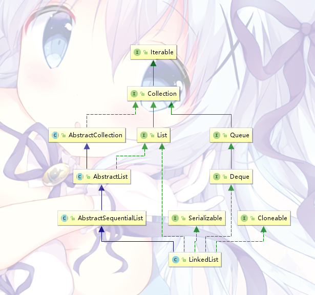

# JAVA集合-List

List集合表示一个元素有序、可重复的线性表

平时使用最多的有ArrayList、LinkedList、Vector、Stack

---

## AbstractList

AbstractList是一个抽象类，实现了List接口，是List接口的主要子类

---

## ArrayList

ArrayList继承了AbstractList，底层使用的是Object数组，因此ArrayList本质上是一个可以动态扩容的数组。另外，ArrayList不支持多线程同步

ArrayList的本体（默认大小为10）：
```java
private static final int DEFAULT_CAPACITY = 10;

transient Object[] elementData;
```

#### 初始化

ArrayList的初始化构造函数有仨：
 * 提供一个初始容量
 * 使用默认构造函数（默认初始大小为10）
 * 提供一个已经存在的集合

```java
    /**
     * Constructs an empty list with an initial capacity of ten.
     */ 
    public ArrayList(int initialCapacity) {
        if (initialCapacity > 0) {
            this.elementData = new Object[initialCapacity];
        } else if (initialCapacity == 0) {
            this.elementData = EMPTY_ELEMENTDATA;
        } else {
            throw new IllegalArgumentException("Illegal Capacity: "+
                                               initialCapacity);
        }
    }

    /**
     * Constructs an empty list with an initial capacity of ten.
     *
     * 可以看到，调用默认构造函数的时候，赋了个空数组
     * 向数组中添加第一个元素时，数组容量才扩为10
     */
    public ArrayList() {
        this.elementData = DEFAULTCAPACITY_EMPTY_ELEMENTDATA;
    }

    private static final Object[] DEFAULTCAPACITY_EMPTY_ELEMENTDATA = {};

    /**
     * 使用一个集合来初始化，这里不想太多了解
     */
    public ArrayList(Collection<? extends E> c) {
        elementData = c.toArray();
        if ((size = elementData.length) != 0) {
            if (elementData.getClass() != Object[].class)
                elementData = Arrays.copyOf(elementData, size, Object[].class);
        } else {
            this.elementData = EMPTY_ELEMENTDATA;
        }
    }
```

#### 扩容

这里由*add*方法作为起点开始追踪

```java
    public boolean add(E e) {
        // 由这里去检查是否需要扩容
        ensureCapacityInternal(size + 1);
        elementData[size++] = e;
        return true;
    }
```
会发现，往数组添加元素的时候，会先检查是否需要扩容，继续追踪
```java
    private void ensureCapacityInternal(int minCapacity) {
        ensureExplicitCapacity(calculateCapacity(elementData, minCapacity));
    }
```
里头直接调用了*ensureExplicitCapacity*方法，参数emmmm……还是*calculateCapacity*方法的返回值，先看*calculateCapacity*方法
```java
    /**
     * 这个方法是用来获取一个最小扩容容量
     */
    private static int calculateCapacity(Object[] elementData, int minCapacity) {
        // 如果数组为空，直接比较10和minCapacity返回大的
        if (elementData == DEFAULTCAPACITY_EMPTY_ELEMENTDATA) {
            return Math.max(DEFAULT_CAPACITY, minCapacity);
        }
        // 不为空了就直接返回minCapacity
        return minCapacity;
    }
```
得到扩容大小之后，看看*ensureExplicitCapacity*方法
```java
    private void ensureExplicitCapacity(int minCapacity) {
        // modCount是一个用来记录数组修改次数的变量，这里无关
        modCount++;

        // 合法性校验
        if (minCapacity - elementData.length > 0)
            grow(minCapacity);
    }
```
最后就是实际的扩容操作了
```java
    private void grow(int minCapacity) {
        int oldCapacity = elementData.length;
        // newCapacity = oldCapacity * 1.5
        int newCapacity = oldCapacity + (oldCapacity >> 1);
        // 如果newCapacity比指定的扩容量小的话，就把指定扩容大小作为数组新的大小
        if (newCapacity - minCapacity < 0)
            newCapacity = minCapacity;
        // 再检查新的大小是否超过最大限制，做最后处理
        if (newCapacity - MAX_ARRAY_SIZE > 0)
            newCapacity = hugeCapacity(minCapacity);
        // 实际的扩容是调用Arrays.copyOf方法进行的
        elementData = Arrays.copyOf(elementData, newCapacity);
    }

    /**
     * 比较新容量与最大限制
     * 如果新容量比MAX_ARRAY_SIZE大，则Integer.MAX_VALUE，否则MAX_ARRAY_SIZE
     */
    private static int hugeCapacity(int minCapacity) {
        if (minCapacity < 0) // overflow
            throw new OutOfMemoryError();
        return (minCapacity > MAX_ARRAY_SIZE) ?
            Integer.MAX_VALUE :
            MAX_ARRAY_SIZE;
    }

    private static final int MAX_ARRAY_SIZE = Integer.MAX_VALUE - 8;
```
ArrayList扩容操作大致如上，也就是说，ArrayList默认扩容大小是1.5x

讲真扩容操作看起来简单，换作自己写可能1min不到就出来一句*Arrays.copyOf(elementData, newCapacity)*，over。当初第一次看源码的时候
也是看得一愣一愣的

---

## Vector

Vector与ArrayList非常类似，继承了AbstractList，底层数据结构也是一个Object数组

与ArrayList最大的区别在于，Vector是支持多线程环境的，在多线程环境下使用时，Vector能保证自身的线程安全

（当然，效率嘛………………

#### 保证线程安全的方式

Vector主要是使用*synchronized*关键字进行同步的

#### capacityIncrement

扫Vector的源码的时候发现成员变量中多了一个*capacityIncrement*

IDEA选中后发现只有两处用到了：序列化writeObject的时候和扩容的时候……

因此才发现，Vector的扩容与ArrayList稍有不同：
```java
    private void grow(int minCapacity) {
        int oldCapacity = elementData.length;
        //如果capacityIncrement有效，则扩容增量为capacityIncrement，否则原数组大小*2
        int newCapacity = oldCapacity + ((capacityIncrement > 0) ?
                                         capacityIncrement : oldCapacity);
        if (newCapacity - minCapacity < 0)
            newCapacity = minCapacity;
        if (newCapacity - MAX_ARRAY_SIZE > 0)
            newCapacity = hugeCapacity(minCapacity);
        elementData = Arrays.copyOf(elementData, newCapacity);
    }
```
也就是说Vector的扩容默认是2x的

---

## LinkedList

LinkedList继承自AbstractSequentialList，AbstractSequentialList继承自AbstractList

LinkedList与ArrayList使用起来差不多，但LinkedList是使用链表作为数组，而且是双向列表
```java
    /**
     * LinkedList里头的内部类，非常的简单
     */
    private static class Node<E> {
        E item;
        Node<E> next;
        Node<E> prev;

        Node(Node<E> prev, E element, Node<E> next) {
            this.item = element;
            this.next = next;
            this.prev = prev;
        }
    }
```
LinkedList不支持多线程

另外，LinkedList还是Queue的近亲：


正因如此，LinkedList有*getFirst()*、*getLast()* 、*removeFirst()*、*removeLast()*、*addFirst(E e)*、*addLast(E e)*，甚至*peek()*、*poll()*、*offer(E e)*、*push(E e)*、*pop()*等一众方法

LinkedList大概可以直接当栈或者队列用

#### 源码赏析
```java
    /**
     * Links e as first element.
     */
    private void linkFirst(E e) {
        final Node<E> f = first;
        final Node<E> newNode = new Node<>(null, e, f);
        first = newNode;
        if (f == null)
            last = newNode;
        else
            f.prev = newNode;
        size++;
        modCount++;
    }

    /**
     * Links e as last element.
     */
    void linkLast(E e) {
        final Node<E> l = last;
        final Node<E> newNode = new Node<>(l, e, null);
        last = newNode;
        if (l == null)
            first = newNode;
        else
            l.next = newNode;
        size++;
        modCount++;
    }

    /**
     * Unlinks non-null first node f.
     */
    private E unlinkFirst(Node<E> f) {
        // assert f == first && f != null;
        final E element = f.item;
        final Node<E> next = f.next;
        f.item = null;
        f.next = null; // help GC
        first = next;
        if (next == null)
            last = null;
        else
            next.prev = null;
        size--;
        modCount++;
        return element;
    }

    /**
     * Unlinks non-null last node l.
     */
    private E unlinkLast(Node<E> l) {
        // assert l == last && l != null;
        final E element = l.item;
        final Node<E> prev = l.prev;
        l.item = null;
        l.prev = null; // help GC
        last = prev;
        if (prev == null)
            first = null;
        else
            prev.next = null;
        size--;
        modCount++;
        return element;
    }

    /**
     * Unlinks non-null node x.
     */
    E unlink(Node<E> x) {
        // assert x != null;
        final E element = x.item;
        final Node<E> next = x.next;
        final Node<E> prev = x.prev;

        if (prev == null) {
            first = next;
        } else {
            prev.next = next;
            x.prev = null;
        }

        if (next == null) {
            last = prev;
        } else {
            next.prev = prev;
            x.next = null;
        }

        x.item = null;
        size--;
        modCount++;
        return element;
    }
```

基本上LinkedList的增删操作最终都会调用上面的方法

---

## Stack

Stack，栈

继承自Vector，因此也是数组结构

（所以说想体会链表结构的栈可以用LindekList

因为代码十分简单，直接挂源码
```java
public class Stack<E> extends Vector<E> {
    
    public Stack() {
    }

    public E push(E item) {
        addElement(item);

        return item;
    }

    public synchronized E pop() {
        E       obj;
        int     len = size();

        obj = peek();
        removeElementAt(len - 1);

        return obj;
    }

    public synchronized E peek() {
        int     len = size();   // 这些迷之缩进真不是我的锅

        if (len == 0)
            throw new EmptyStackException();
        return elementAt(len - 1);
    }

    public boolean empty() {
        return size() == 0;
    }

    public synchronized int search(Object o) {
        int i = lastIndexOf(o);

        if (i >= 0) {
            return size() - i;
        }
        return -1;
    }
}
```

会发现Stack的操作基本上是靠调用Vector的方法实现，并且本身也使用*synchronized*关键字保证多线程环境下的同步