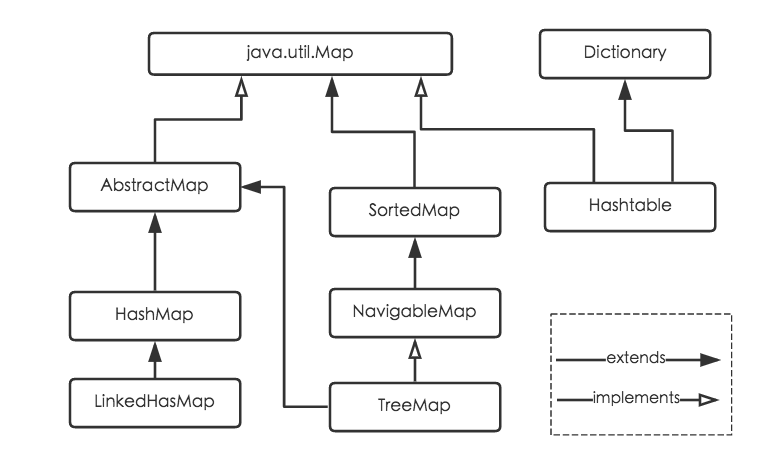
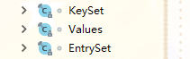
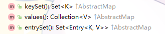
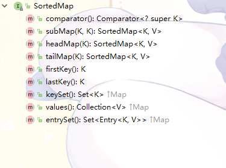

# JAVA集合-Map

Map存储的是一个键值对(key-value)的集合，key元素不能重复，由key映射到value

Map接口和Collection接口是独立并排的

常用的Map有HashMap、LinkedHashMap、Hashtable、TreeMap



这里直接上实现了

# HashMap

> HashMap部分的图均来自 http://www.importnew.com/20386.html

**jdk1.7和1.8中HashMap的改动较大，这里均以jdk1.8展开**

HashMap是根据key的hashcode定位存储位置保存value，大部分情况下，只需要一次便可定位到value，因此效率贼高

HashMap不支持多线程同步，key的值可以为null，但是只能有一个 

## HashMap的结构

HashMap使用一个Node数组（哈希桶数组）存储键值对，Node为HashMap的一个内部类

```java
    transient Node<K,V>[] table;

    static class Node<K,V> implements Map.Entry<K,V> {
        final int hash;
        final K key;
        V value;
        Node<K,V> next;
    }
```

当hashc产生冲突时，HashMap使用链地址法处理冲突，因此数组的每一个节点都是一个链表（这一点从Node的结构也能看出来

jkd1.8中，当链表过长时（默认8），HashMap会将这个节点的数组转成一个红黑树,大幅提高了在冲突过多时HashMap的性能

```java
    static final class TreeNode<K,V> extends LinkedHashMap.Entry<K,V> {
        TreeNode<K,V> parent;  // red-black tree links
        TreeNode<K,V> left;
        TreeNode<K,V> right;
        TreeNode<K,V> prev;    // needed to unlink next upon deletion
        boolean red;
    }
```
HashMap的红黑树节点长这样↑↑↑


## 初始容量和加载因子

```java
    /**
     * HashMap所能容纳最大的Node的数量
     * 这个不是桶数组的容量table.length
     */
    int threshold;

    /**
     * 负载因子
     */
    final float loadFactor;
```

*threshold = table.length * loadFactor*

HashMap默认桶的大小为16，并且桶大小只能为2的次方

当HashMap内Node节点的数量大于threshold时，就会触发扩容

## 初始化

*HahMap*有两个实际上的构造方法：

```java
    public HashMap(Map<? extends K, ? extends V> m) {
        this.loadFactor = DEFAULT_LOAD_FACTOR;
        putMapEntries(m, false);
    }

    public HashMap(int initialCapacity, float loadFactor) {
        if (initialCapacity < 0)
            throw new IllegalArgumentException("Illegal initial capacity: " +
                                               initialCapacity);
        if (initialCapacity > MAXIMUM_CAPACITY)
            initialCapacity = MAXIMUM_CAPACITY;
        if (loadFactor <= 0 || Float.isNaN(loadFactor))
            throw new IllegalArgumentException("Illegal load factor: " +
                                               loadFactor);
        this.loadFactor = loadFactor;
        this.threshold = tableSizeFor(initialCapacity);
    }
```

看第二个，它在*tableSizeFor*对传进来的自定义容量进行了处理

```java
    static final int tableSizeFor(int cap) {
        int n = cap - 1;
        n |= n >>> 1;
        n |= n >>> 2;
        n |= n >>> 4;
        n |= n >>> 8;
        n |= n >>> 16;
        return (n < 0) ? 1 : (n >= MAXIMUM_CAPACITY) ? MAXIMUM_CAPACITY : n + 1;
    }
```

简单来说，这个方法会把cap调整为一个不小于它的最小的2^n数（毕竟桶大小只能为2的次方

比如1会变成2，9会变成16，99会变成128这样

**HashMap的本体数组实际初始化的位置是在第一次往Map丢东西的时候**

本体数组初始化逻辑在扩容方法里，之后会讲

## hash

在增删改凡是要定位到桶数组的索引的时候，都需要对key进行hash

HashMap进行hash的方法：
```java
    static final int hash(Object key) {
        int h;
        return (key == null) ? 0 : (h = key.hashCode()) ^ (h >>> 16);
    }
```
HashMap先获得key的hashCode，然后高16位不变，再通过对hashCode的高16位，去异或它自己的低16位，这样最终获得hash结果

定位到桶数组的代码在各自调用者那，接下来

## get

HashMap通过key获取value的方法如下

```java
    public V get(Object key) {
        Node<K,V> e;
        return (e = getNode(hash(key), key)) == null ? null : e.value;
    }
```

方法相当简洁，*hash(key)* 后直接丢进*getNode*，然后判断是否有结果返回

跟踪进去

```java
    final Node<K,V> getNode(int hash, Object key) {
        Node<K,V>[] tab; 
        Node<K,V> first, e; 
        int n; K k; 
        /*
            这里做了仨判断：
            table桶数组是不是null
            table是不是空的
            最后是根据hashCode定位到数组下标，判断有没东西
         */
        if ((tab = table) != null && (n = tab.length) > 0 
                && (first = tab[(n - 1) & hash]) != null) {
            /*
                这一句判断头节点，是不是就是要找的东西
             */
            if (first.hash == hash && // always check first node
                ((k = first.key) == key || (key != null && key.equals(k))))
                return first;
            // 头节点不是，并且之后还有数据的话
            if ((e = first.next) != null) { 
                // 如果这个节点是红黑树形式，调用getTreeNode去找
                if (first instanceof TreeNode)
                    return ((TreeNode<K,V>)first).getTreeNode(hash, key);
                // 链表形式，直接顺着链表找
                do {
                    if (e.hash == hash &&
                        ((k = e.key) == key || (key != null && key.equals(k))))
                        return e;
                } while ((e = e.next) != null);
            }
        }
        return null;
    }
```

get方法并不难，重点在*first = tab[(n - 1) & hash]* 这一句，它便是取模运算定位数组下标

n是数组的长度：*n = tab.length*

n-1呢，桶数组的大小只能是2的次方，那么n-1之后n的二进制形式便是全1

假设*n = 16*，*n - 1 = 15 = 1111(b)*

*hash = 114514 = 11011111101010010(b)*

那么 *(n - 1) & hash = 10(b) = 2*，即数组下标为2

放张图总结下


## put

```java
    public V put(K key, V value) {
        return putVal(hash(key), key, value, false, true);
    }
```

和get一样，调用了另一个方法

```java
    final V putVal(int hash, K key, V value, boolean onlyIfAbsent,
                   boolean evict) {
        Node<K,V>[] tab; 
        Node<K,V> p; 
        int n, i;
        // 桶数组为空先扩容
        if ((tab = table) == null || (n = tab.length) == 0)
            n = (tab = resize()).length
        // 定位之后如果没有冲突，直接就地新建一个节点
        if ((p = tab[i = (n - 1) & hash]) == null)
            tab[i] = newNode(hash, key, value, null);
        // 有冲突的处理
        else {
            Node<K,V> e; 
            K k;
            /*
                这一段ifelse是找出需要替换/插入的节点e
             */
            // 头节点就找到了
            if (p.hash == hash &&
                ((k = p.key) == key || (key != null && key.equals(k))))
                e = p;
            // 如果这个节点是红黑树
            else if (p instanceof TreeNode)
                e = ((TreeNode<K,V>)p).putTreeVal(this, tab, hash, key, value);
            // 是链表的话就一个个遍历
            else { 
                for (int binCount = 0; ; ++binCount) {  // binCount用于统计链表长度
                    // 如果链表之后的节点都为null了还没找到，就新建节点
                    if ((e = p.next) == null) {
                        p.next = newNode(hash, key, value, null);
                        // 判断binCount有没超过桶允许的容量上限，有的话就将链表转换为红黑树了
                        if (binCount >= TREEIFY_THRESHOLD - 1) 
                            treeifyBin(tab, hash);
                        break;
                    }
                    // 和之前判断头节点一样，判断这个节点是不是相同的key
                    if (e.hash == hash &&
                        ((k = e.key) == key || (key != null && key.equals(k))))
                        break;
                    p = e;
                }
            }
            /*
                如果e不是null的话（就是找到了在此之前put过旧的数据）将旧的value返回
             */
            if (e != null) { 
                V oldValue = e.value;
                if (!onlyIfAbsent || oldValue == null)
                    e.value = value;
                afterNodeAccess(e);
                return oldValue;
            }
        }
        // 修改次数+1
        ++modCount;
        // 如果size已经大于最大容量了，扩容
        if (++size > threshold)
            resize();
        afterNodeInsertion(evict);
        return null;
    }

    // Callbacks to allow LinkedHashMap post-actions
    void afterNodeAccess(Node<K,V> p) { }
    void afterNodeInsertion(boolean evict) { }
```

put操作的主要流程都在注释里了，看得有点绕其实就是那样回事

数组空就新建，没冲突就插，有冲突就找找看有没有旧值，没有就直接插，有就替换，最后该转红黑树转，该扩容扩

可以关注下什么时候转换为红黑树，以及旧值的返回

链表转红黑树由于~~个人能力~~懒就算了

## 扩容

put操作的时候有提到扩容，都是调用*resize()*

扩容包括了~~扩容~~、再hash

resize方法非常冗长，为了可读性优化了下~~然后变得更冗长了~~

```java
    final Node<K,V>[] resize() {
        // 旧的数组和信息
        Node<K,V>[] oldTab = table;
        int oldCap = (oldTab == null) ? 0 : oldTab.length;
        int oldThr = threshold;

        int newCap, newThr = 0;

        // 正常情况
        if (oldCap > 0) {
            // 如果酒的数组长度已经大于1 << 30，就把threshold设为(1 << 31) -1
            if (oldCap >= MAXIMUM_CAPACITY) {
                threshold = Integer.MAX_VALUE;
                return oldTab;
            }
            // 一般情况下是扩容两倍
            else if ((newCap = oldCap << 1) < MAXIMUM_CAPACITY &&
                     oldCap >= DEFAULT_INITIAL_CAPACITY)
                newThr = oldThr << 1; // double threshold
        }
        // 据说在第一次带参数初始化时候会有这种情况
        else if (oldThr > 0) // initial capacity was placed in threshold
            newCap = oldThr;
        // 如果使用的是无参构造方法，会有这种情况，全部设为默认值
        else {               // zero initial threshold signifies using defaults
            newCap = DEFAULT_INITIAL_CAPACITY;
            newThr = (int)(DEFAULT_LOAD_FACTOR * DEFAULT_INITIAL_CAPACITY);
        }

        // 如果还是0（大概就是刚才else if出来的
        if (newThr == 0) {
            float ft = (float)newCap * loadFactor;
            // 如果newCap和ft有一个已经大于1 << 30，就把newThr设为(1 << 31) -1
            newThr = (newCap < MAXIMUM_CAPACITY && ft < (float)MAXIMUM_CAPACITY ?
                      (int)ft : Integer.MAX_VALUE);
        }
        // 把新的值赋值过去
        threshold = newThr;

        // 新建一个新的桶数组
        @SuppressWarnings({"rawtypes","unchecked"})
            Node<K,V>[] newTab = (Node<K,V>[])new Node[newCap];
        table = newTab;

        // 旧数组没东西的话直接回去了
        if (oldTab != null) {
            // 一个个遍历旧数组的节点
            for (int j = 0; j < oldCap; ++j) {
                Node<K,V> e;
                // 节点是空的话也直接跳过了
                if ((e = oldTab[j]) != null) {
                    oldTab[j] = null;

                    // 如果只有一个头节点，直接再hash
                    if (e.next == null)
                        newTab[e.hash & (newCap - 1)] = e;
                    // 节点是红黑树的情况
                    else if (e instanceof TreeNode)
                        ((TreeNode<K,V>)e).split(this, newTab, j, oldCap);
                    // 处理链表
                    else { 
                        Node<K,V> loHead = null, loTail = null; // 留原位的节点链表
                        Node<K,V> hiHead = null, hiTail = null; // 不留的节点链表
                        Node<K,V> next;

                        do {
                            next = e.next;
                            // 留在原位的节点
                            if ((e.hash & oldCap) == 0) {
                                if (loTail == null)
                                    loHead = e;
                                else
                                    loTail.next = e;
                                loTail = e;
                            }
                            // 搬到新家的节点
                            else {
                                if (hiTail == null)
                                    hiHead = e;
                                else
                                    hiTail.next = e;
                                hiTail = e;
                            }
                        } while ((e = next) != null);

                        // 这些原来在几号下标的就直接搬到新数组的几号下标去
                        if (loTail != null) {
                            loTail.next = null;
                            newTab[j] = loHead;
                        }

                        // 这些就原来下标+oldCap，就是新数组的下标
                        if (hiTail != null) {
                            hiTail.next = null;
                            newTab[j + oldCap] = hiHead;
                        }
                    }
                }
            }
        }
        return newTab;
    }
```
整体上思路就是，新建一个新家，然后旧数组一个个扫描过去，看下应该怎么搬家

jdk1.8对链表节点的再hash做了优化（可能不看这段话先看上面的代码会一脸懵逼）：

先回去看下上面的**get**，HashMap是怎么做下标定位的

问题来了，HashMap的扩容是x2，对于二进制来讲就是多了1位，对于定位数组下标来讲，需要做&操作的数多了1位

也就是说，一个元素需不需要在新的数组里换一个下标，就看它的hash，在多出来的那1位里，值是1还是0

0的话开开心心留在原位，1的话就要搬家了，而且下标增加的量，恰好是旧数组的大小（再想想HashMap的扩容是x2）

上面扩容方法在对链表扩容的时候，就是用的俩链表，一条保存要搬的一条保存不要的，到时候整体赋值就好

最后再贴张图：


## 获取集合

HashMap里头有仨这样的类：



有仨这样的方法：



它们分别返回key的集合、value的集合和key-value键值对的集合

以EntrySet为例（因为这仨真的差不多一摸一样

方法：
```java
    public Set<Map.Entry<K,V>> entrySet() {
        Set<Map.Entry<K,V>> es;
        return (es = entrySet) == null ? (entrySet = new EntrySet()) : es;
    }
```
内部类：
```java
    final class EntrySet extends AbstractSet<Map.Entry<K,V>> {
        public final int size()                 { return size; }
        public final void clear()               { HashMap.this.clear(); }
        public final Iterator<Map.Entry<K,V>> iterator() {
            return new EntryIterator();
        }
        public final boolean contains(Object o) {
            if (!(o instanceof Map.Entry))
                return false;
            Map.Entry<?,?> e = (Map.Entry<?,?>) o;
            Object key = e.getKey();
            Node<K,V> candidate = getNode(hash(key), key);
            return candidate != null && candidate.equals(e);
        }
        public final boolean remove(Object o) {
            if (o instanceof Map.Entry) {
                Map.Entry<?,?> e = (Map.Entry<?,?>) o;
                Object key = e.getKey();
                Object value = e.getValue();
                return removeNode(hash(key), key, value, true, true) != null;
            }
            return false;
        }
        public final Spliterator<Map.Entry<K,V>> spliterator() {
            return new EntrySpliterator<>(HashMap.this, 0, -1, 0, 0);
        }
        public final void forEach(Consumer<? super Map.Entry<K,V>> action) {
            Node<K,V>[] tab;
            if (action == null)
                throw new NullPointerException();
            if (size > 0 && (tab = table) != null) {
                int mc = modCount;
                for (int i = 0; i < tab.length; ++i) {
                    for (Node<K,V> e = tab[i]; e != null; e = e.next)
                        action.accept(e);
                }
                if (modCount != mc)
                    throw new ConcurrentModificationException();
            }
        }
    }
```
会发现，这EntrySet没啥能直接用的方法

对的很明显我们最好用迭代器来遍历获取到的这个集合

比如这样↓↓↓
```java
    Iterator<Map.Entry<Object, Object>> i = map.entrySet().iterator();
    while (i.hasNext()) {
        Map.Entry<Object, Object> e = i.next();

        e.getKey();
        e.getValue();
    }
```

# Hashtable

个人觉得，Hashtable和HashMap这俩就跟Vector和ArrayList一样

前者都是jdk1.0这种上古时期的产物（看看Hashtable的命名），而且都是线程安全的，都是用*synchronized*来保证线程安全（好像那会也只能用它了吧）

后者都是比较新的，效率高于前者，都同样不支持多线程同步

而且两者操作方式基本没有任何差别OTZ

Hashtable实现了Map接口，但是不像HashMap那样拓展自AbstractMap，而是Dictionary

```java
    private transient Entry<?,?>[] table;

    private static class Entry<K,V> implements Map.Entry<K,V> {
        final int hash;
        final K key;
        V value;
        Entry<K,V> next;
    }
```
Hashtable的本体，可以看出使用链地址法处理冲突（然而并没有红黑树）

和HashMap一样，Hashtable也有threshold、loadFactor，定义也一样

## Dictionary

一个已经过时的抽象类（毕竟已经有Map了），也能储键值对，由key映射到value。它没有父类

Dictionary的key不能为null，所以导致Hashtable也不能接收null的key

# LinkedHashMap

LinkedHashMap继承自HashMap

LinkedHashMap在HashMap的哈希表基础上使用了双向链表，使得LinkedHashMap的迭代顺序和插入顺序一致


```java
    transient LinkedHashMap.Entry<K,V> head;

    transient LinkedHashMap.Entry<K,V> tail;

    static class Entry<K,V> extends HashMap.Node<K,V> {
        Entry<K,V> before, after;
        Entry(int hash, K key, V value, Node<K,V> next) {
            super(hash, key, value, next);
        }
    }

```
LinkedHashMap的节点在Node的基础上增加了向前向后的引用，这用这俩配合*head*、*tail*形成一个双向链表

当然，Node里面的属性还是原来的作用，该怎样怎样。LinkedHashMap这里新加的属性也仅仅只是为双向链表服务

在HashMap中，有三个空方法（之前在put方法里也有过调用）：
```java
    // Callbacks to allow LinkedHashMap post-actions
    void afterNodeAccess(Node<K,V> p) { }
    void afterNodeInsertion(boolean evict) { }
    void afterNodeRemoval(Node<K,V> p) { }
```
而在LinkedHashMap中重写了这三个方法，它们的作用主要是维护双链表，使得它的顺序保证正确

# SortedMap

顾名思意，提供一个有序的Map



虽然实现了Map结构，但是也没在这之上增加上面太多的其他方法

因为是有序的，所以可以提供针对头和尾的操作

你甚至还能够通过 *subMap(K fromKey, K toKey)* 获取在这俩key中间的Map集合

# TreeMap

TreeMap是一个有序的Map，实现了SortedMap接口（中间还隔着一个NavigableMap接口）

NavigableMap接口直接继承自SortedMap，使得SortedMap有了导航能力，TreeMap是NavigableMap接口唯一的实现

TreeMap底层是一个红黑树

```java
    private transient Entry<K,V> root;

    static final class Entry<K,V> implements Map.Entry<K,V> {
        K key;
        V value;
        Entry<K,V> left;
        Entry<K,V> right;
        Entry<K,V> parent;
        boolean color = BLACK;
    }
```

TreeMap也有一个比较器
```java
    private final Comparator<? super K> comparator;
```
但是并没有强制要求key实现*Comparable*接口，所以使用TreeMap的时候没有传入*Comparator*，并且用了一个没有实现*Comparable*接口的类作为key，会产生ClassCastException

## 插入/删除 

TreeMap的操作不再是依靠哈希表，因此和前面的Map类有很大区别
```java
    public V put(K key, V value) {
        Entry<K,V> t = root;
        // 空树的情况
        if (t == null) {
            compare(key, key); // type (and possibly null) check

            root = new Entry<>(key, value, null);   // 直接插
            size = 1;
            modCount++;
            return null;
        }
        int cmp;
        Entry<K,V> parent;
        Comparator<? super K> cpr = comparator;
        // 如果有比较器
        if (cpr != null) {
            do {
                parent = t;
                cmp = cpr.compare(key, t.key);
                // 根据红黑树性质一路下去搜索
                if (cmp < 0)
                    t = t.left;
                else if (cmp > 0)
                    t = t.right;
                else
                    return t.setValue(value);   // 找到了旧的元素的话，替换掉
            } while (t != null);
        }
        // 没有比较器的情况，这就要靠key的compareTo了
        else {
            // 因此这里key不能为null，虽然TreeMap可以有null的key
            if (key == null)
                throw new NullPointerException();
            @SuppressWarnings("unchecked")
                Comparable<? super K> k = (Comparable<? super K>) key;
            do {
                parent = t;
                // 这里的逻辑和刚才一样
                cmp = k.compareTo(t.key);
                if (cmp < 0)
                    t = t.left;
                else if (cmp > 0)
                    t = t.right;
                else
                    return t.setValue(value);
            } while (t != null);
        }
        // 如果上面一路过来之后没找到旧元素，就往树里插一个新的元素
        Entry<K,V> e = new Entry<>(key, value, parent);
        if (cmp < 0)
            parent.left = e;
        else
            parent.right = e;
        // 修复变动之后的红黑树
        fixAfterInsertion(e);
        size++;
        modCount++;
        return null;
    }
```
插入的逻辑挺简单的，如果是空树直接插，否则一路比较下去找到合适的子节点插入，当然如果中间找到了key相等的旧元素就直接替换，最后再调整红黑树

可以看到这里已经完全没有任何的hash操作了，用多了各种有哈希表的Map已经让自己觉得Map就应该是有hash了，看代码的时候有点不适应。。

```java
    public V remove(Object key) {
        // 先把旧值返回回去
        Entry<K,V> p = getEntry(key);
        if (p == null)
            return null;

        V oldValue = p.value;
        // 将找出来的节点传进去进行删除操作
        deleteEntry(p);
        return oldValue;
    }
```
二叉树排序的删除操作向来麻烦，红黑树更不例外 ~~这就是我不看源码的原因~~

删除节点大概有三种情况：

* 1.节点为叶子节点

    这个好办，直接删除就好
* 2.节点有一个孩子

    也好办，删掉，直接让孩子代替自己的位置
* 3.节点有俩孩子
    
    这种情况下，应该让左子树的最大节点or右子树的最小节点，替换掉要删除的当前节点，二选一即可。这样也转换为第2种情况了

TreeMap的删除操作大致是先判断是不是第3种情况，是的话就转换为第2种或者第1种，然后再进行删除，当然最后也要调整红黑树

## 其他

因为TreeMap的操作都是在树上进行，因此效率会比HashMap这些低不少

倒不如说这货其实就是一个附带Map功能的红黑树= =

正常情况下选用HashMap没错，如果对元素需要排序的时候，再考虑TreeMap也不迟