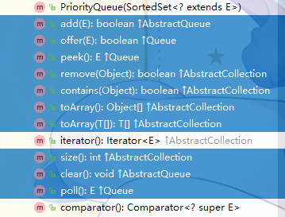
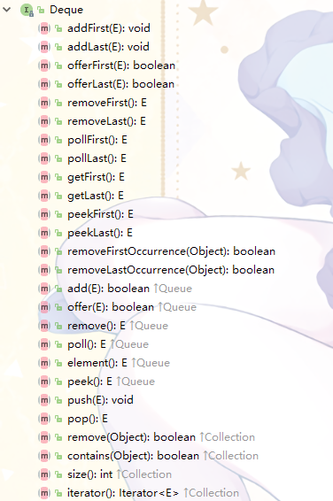
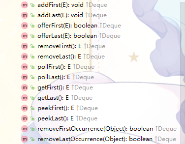
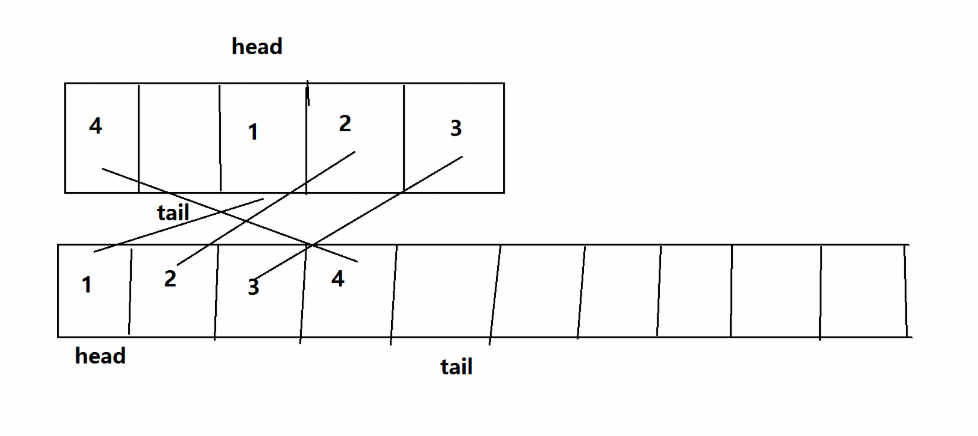

# JAVA集合-List

Queue表示了一个FIFO的队列结构

Queue的元素是有序、可重复的

Queue接口是一个单向队列，它的子类Deque接口则是一个双向队列

常用的实现类有PriorityQueue和ArrayDeque（还有LinkedList，List接口部分已经有了

---

## PriorityQueue

PriorityQueue即优先队列，队列根据元素的权值大小保持了队中元素的顺序，并且保证出队的是权值最小的元素

优先队列，通常又叫做堆，因此PriorityQueue是一个小顶堆

堆一般使用数组保存它的完全二叉树，因此PriorityQueue的本体是一个Object数组

（强行分析.jpg↑↑↑

```java
    transient Object[] queue;
```

#### 初始化

PriorityQueue的构造方法乍一看很多，其实你叼我我叼你最后只有两个是有用的：
```java
    /**
     * 这个方法是通过给定初始化容量和Comparator构造一个空的优先队列
     */
    public PriorityQueue(int initialCapacity,
                         Comparator<? super E> comparator) {
        if (initialCapacity < 1)
            throw new IllegalArgumentException();
        this.queue = new Object[initialCapacity];
        this.comparator = comparator;
    }

    /* ———————————————————————————————————————— */

    /**
     * 也可以直接提供一个Collection进行初始化
     * 分为三种情况
     */
    public PriorityQueue(Collection<? extends E> c) {
        if (c instanceof SortedSet<?>) {
            SortedSet<? extends E> ss = (SortedSet<? extends E>) c;
            this.comparator = (Comparator<? super E>) ss.comparator();
            initElementsFromCollection(ss);
        }
        else if (c instanceof PriorityQueue<?>) {
            PriorityQueue<? extends E> pq = (PriorityQueue<? extends E>) c;
            this.comparator = (Comparator<? super E>) pq.comparator();
            initFromPriorityQueue(pq);
        }
        else {
            this.comparator = null;
            initFromCollection(c);
        }
    }

    /**
     * 使用给定的PriorityQueue来初始化PriorityQueue
     */
    private void initFromPriorityQueue(PriorityQueue<? extends E> c) {
        if (c.getClass() == PriorityQueue.class) {
            this.queue = c.toArray();
            this.size = c.size();
        } else {
            initFromCollection(c);
        }
    }
    
    /**
     * 使用给定的Collection来初始化PriorityQueue
     */
    private void initFromCollection(Collection<? extends E> c) {
        initElementsFromCollection(c);
        // 这里重新建一个小顶堆
        heapify();
    }

    /**
     * 使用给定的Collection来初始化PriorityQueue里 面 的 元 素
     */
    private void initElementsFromCollection(Collection<? extends E> c) {
        Object[] a = c.toArray();
        // If c.toArray incorrectly doesn't return Object[], copy it.
        if (a.getClass() != Object[].class)
            a = Arrays.copyOf(a, a.length, Object[].class);
        int len = a.length;
        if (len == 1 || this.comparator != null)
            for (int i = 0; i < len; i++)
                if (a[i] == null)
                    throw new NullPointerException();
        this.queue = a;
        this.size = a.length;
    }
```

#### 操作
PriorityQueue的操作和正常的队列差不多，该有的方法都有，使用起来没什么两样，只不过它会自动维护小顶堆，取到的永远是最小的元素而已



#### 堆

PriorityQueue是一个小顶堆，当有增删操作的时候必须要对这个堆进行维护

上面的操作方法中，均会调用*siftUp(int k, E x)*、*siftDown(int k, E x)*：

* 往PriorityQueue增加元素时，最把新进元素追加到数组最后（即叶子节点），这时候调用*siftUp(int k, E x)*
* 从PriorityQueue删除元素时，会把数组最后一个元素填充到空出来的位置，这时调用*siftDown(int k, E x)*

这俩方法就是建堆或者对堆的一个维护

```java
    /**
     * 从k指定的位置开始，将x逐层与当前点的parent进行比较并交换，
     * 直到满足x >= queue[parent]为止
     */
    private void siftUp(int k, E x) {
        if (comparator != null)
            siftUpUsingComparator(k, x);
        else
            siftUpComparable(k, x);
    }

    @SuppressWarnings("unchecked")
    private void siftUpComparable(int k, E x) {
        Comparable<? super E> key = (Comparable<? super E>) x;
        while (k > 0) {
            int parent = (k - 1) >>> 1;
            Object e = queue[parent];
            if (key.compareTo((E) e) >= 0)
                break;
            queue[k] = e;
            k = parent;
        }
        queue[k] = key;
    }

    @SuppressWarnings("unchecked")
    private void siftUpUsingComparator(int k, E x) {
        while (k > 0) {
            int parent = (k - 1) >>> 1;
            Object e = queue[parent];
            if (comparator.compare(x, (E) e) >= 0)
                break;
            queue[k] = e;
            k = parent;
        }
        queue[k] = x;
    }

    /**
     * 从k指定的位置开始，将x逐层向下与当前点的左右孩子中较小的那个交换，
     * 直到x小于或等于左右孩子中的任何一个为止
     */
    private void siftDown(int k, E x) {
        if (comparator != null)
            siftDownUsingComparator(k, x);
        else
            siftDownComparable(k, x);
    }

    @SuppressWarnings("unchecked")
    private void siftDownComparable(int k, E x) {
        Comparable<? super E> key = (Comparable<? super E>)x;
        int half = size >>> 1;        // loop while a non-leaf
        while (k < half) {
            int child = (k << 1) + 1; // assume left child is least
            Object c = queue[child];
            int right = child + 1;
            if (right < size &&
                ((Comparable<? super E>) c).compareTo((E) queue[right]) > 0)
                c = queue[child = right];
            if (key.compareTo((E) c) <= 0)
                break;
            queue[k] = c;
            k = child;
        }
        queue[k] = key;
    }

    @SuppressWarnings("unchecked")
    private void siftDownUsingComparator(int k, E x) {
        int half = size >>> 1;
        while (k < half) {
            int child = (k << 1) + 1;
            Object c = queue[child];
            int right = child + 1;
            if (right < size &&
                comparator.compare((E) c, (E) queue[right]) > 0)
                c = queue[child = right];
            if (comparator.compare(x, (E) c) <= 0)
                break;
            queue[k] = c;
            k = child;
        }
        queue[k] = x;
    }
```
看得出这些操作都是看着熟悉的堆操作

---

## Deque

Deque接口是Queue接口的子类




可以看出，Deque在Queue的基础上多出了针对队头和队尾的操作

Deque的常用实现有ArrayDeque和LinkedList

---

## ArrayDeque

ArrayDeque，实现了Deque接口，底层是用Object数组实现的循环队列

```java
    transient Object[] elements;

    transient int head;

    transient int tail;
```

ArrayDeque的本体

#### 初始化

之前看ArrayDeque的源代码的时候，发现构造方法调用了一个很有意思的方法：
```java
    private static int calculateSize(int numElements) {
        int initialCapacity = MIN_INITIAL_CAPACITY;
        // Find the best power of two to hold elements.
        // Tests "<=" because arrays aren't kept full.
        if (numElements >= initialCapacity) {
            initialCapacity = numElements;
            initialCapacity |= (initialCapacity >>>  1);
            initialCapacity |= (initialCapacity >>>  2);
            initialCapacity |= (initialCapacity >>>  4);
            initialCapacity |= (initialCapacity >>>  8);
            initialCapacity |= (initialCapacity >>> 16);
            initialCapacity++;

            if (initialCapacity < 0)   // Too many elements, must back off
                initialCapacity >>>= 1;// Good luck allocating 2 ^ 30 elements
        }
        return initialCapacity;
    }

    /**
     * Allocates empty array to hold the given number of elements.
     *
     * @param numElements  the number of elements to hold
     */
    private void allocateElements(int numElements) {
        elements = new Object[calculateSize(numElements)];
    }
```
这是仨构造方法：
```java
    public ArrayDeque() {
        elements = new Object[16];
    }

    public ArrayDeque(int numElements) {
        allocateElements(numElements);
    }

    public ArrayDeque(Collection<? extends E> c) {
        allocateElements(c.size());
        addAll(c);
    }
```
也就是说ArrayDeque默认大小是16，而其他两个方法都有指定的初始化大小

回到*calculateSize(int numElements)*，光看代码自己也是一脸智障完全不知道这几行代码在干啥_(:D)∠)_

于是便亲自试了下*new ArrayDeque(initCaopacity)*：
| initCaopacity | 实际初始化容量 |
| ---:   | ---:  | 
| -1 | 8 |
| 9 | 16 |
| 15 | 16 |
| 16 | 32 |
| 31 | 32 |
| Integer.MAX_VALUE | 1073741824 |

这里已经能很明显看出来ArrayDeque是怎么处理的了

#### 一些特性

ArrayDeque是双向队列，也就是说能同时对队头和队尾进行操作



这里贴出其中几个方法（~~一定不是因为其他的懒得看了~~ 其实里头大部分是调用下面的方法

```java
    public void addFirst(E e) {
        if (e == null)
            throw new NullPointerException();
        elements[head = (head - 1) & (elements.length - 1)] = e;
        if (head == tail)
            doubleCapacity();
    }

    public void addLast(E e) {
        if (e == null)
            throw new NullPointerException();
        elements[tail] = e;
        if ( (tail = (tail + 1) & (elements.length - 1)) == head)
            doubleCapacity();
    }

    public E pollFirst() {
        int h = head;
        @SuppressWarnings("unchecked")
        E result = (E) elements[h];
        // Element is null if deque empty
        if (result == null)
            return null;
        elements[h] = null;     // Must null out slot
        head = (h + 1) & (elements.length - 1);
        return result;
    }

    public E pollLast() {
        int t = (tail - 1) & (elements.length - 1);
        @SuppressWarnings("unchecked")
        E result = (E) elements[t];
        if (result == null)
            return null;
        elements[t] = null;
        tail = t;
        return result;
    }
```
分别是从队头队尾的增删操作

这里用例子看下（每一次循环做一次输出，这里把输出代码删了）：

* **addFirst**
```java
    int[] array = {1, 2, 3, 4, 5, 6, 7, 8};
    ArrayDeque<Integer> deque = new ArrayDeque<Integer>(9);
    for (int i = 0; i < array.length; i++) 
        deque.addFirst(array[i]);
```
output：
```
[ , , , , , , , , , , , , , , ,1]
[ , , , , , , , , , , , , , ,2,1]
[ , , , , , , , , , , , , ,3,2,1]
[ , , , , , , , , , , , ,4,3,2,1]
[ , , , , , , , , , , ,5,4,3,2,1]
[ , , , , , , , , , ,6,5,4,3,2,1]
[ , , , , , , , , ,7,6,5,4,3,2,1]
[ , , , , , , , ,8,7,6,5,4,3,2,1]
```

* **addLast**
```java
    int[] array = {1, 2, 3, 4, 5, 6, 7, 8};
    ArrayDeque<Integer> deque = new ArrayDeque<Integer>(9);
    for (int i = 0; i < array.length; i++) 
        deque.addFirst(array[i]);
```
output：
```
[1, , , , , , , , , , , , , , , ]
[1,2, , , , , , , , , , , , , , ]
[1,2,3, , , , , , , , , , , , , ]
[1,2,3,4, , , , , , , , , , , , ]
[1,2,3,4,5, , , , , , , , , , , ]
[1,2,3,4,5,6, , , , , , , , , , ]
[1,2,3,4,5,6,7, , , , , , , , , ]
[1,2,3,4,5,6,7,8, , , , , , , , ]
```

* **addFirst & addLast**
```java
    int[] array = {1, 2, 3, 4, 5, 6, 7, 8};
    ArrayDeque<Integer> deque = new ArrayDeque<Integer>(9);
    for (int i = 0; i < array.length; i++) {
        if (i % 2 == 1)
            deque.addFirst(array[i]);   // 奇数
        else
            deque.addLast(array[i]);    // 偶数
    }
```
output：
```
[ , , , , , , , , , , , , , , ,1]
[2, , , , , , , , , , , , , , ,1]
[2, , , , , , , , , , , , , ,3,1]
[2,4, , , , , , , , , , , , ,3,1]
[2,4, , , , , , , , , , , ,5,3,1]
[2,4,6, , , , , , , , , , ,5,3,1]
[2,4,6, , , , , , , , , ,7,5,3,1]
[2,4,6,8, , , , , , , , ,7,5,3,1]
```

**以上面↑↑↑的数据作为初始数据，试下删除**

* **pollFirst**
```
[2,4,6,8, , , , , , , , ,7,5,3,1]
[2,4,6,8, , , , , , , , , ,5,3,1]
[2,4,6,8, , , , , , , , , , ,3,1]
[2,4,6,8, , , , , , , , , , , ,1]
[2,4,6,8, , , , , , , , , , , , ]
[ ,4,6,8, , , , , , , , , , , , ]
[ , ,6,8, , , , , , , , , , , , ]
[ , , ,8, , , , , , , , , , , , ]
[ , , , , , , , , , , , , , , , ]
```

* **pollLast**
```
[2,4,6,8, , , , , , , , ,7,5,3,1]
[2,4,6, , , , , , , , , ,7,5,3,1]
[2,4, , , , , , , , , , ,7,5,3,1]
[2, , , , , , , , , , , ,7,5,3,1]
[ , , , , , , , , , , , ,7,5,3,1]
[ , , , , , , , , , , , ,7,5,3, ]
[ , , , , , , , , , , , ,7,5, , ]
[ , , , , , , , , , , , ,7, , , ]
[ , , , , , , , , , , , , , , , ]
```

ArrayDeque简单的操作大概就是这样

| 搭配 | 搭配 | 效果 |
| --- | --- | ---: | 
| addFirst(E e) | pollFirst() | 栈 | 
| addLast(E e) | pollLast() | 栈 | 
| addFirst(E e) | pollLast() | 队列 | 
| addLast(E e) | pollFirst() | 队列 | 

#### 扩容

ArrayDeque的扩容是直接x2
```java
    private void doubleCapacity() {
        assert head == tail;
        int p = head;
        int n = elements.length;
        int r = n - p; // number of elements to the right of p
        int newCapacity = n << 1;
        if (newCapacity < 0)
            throw new IllegalStateException("Sorry, deque too big");
        Object[] a = new Object[newCapacity];
        System.arraycopy(elements, p, a, 0, r);
        System.arraycopy(elements, 0, a, r, p);
        elements = a;
        head = 0;
        tail = n;
    }

    /**
     * System.arraycopy的方法签名
     */
    public static native void arraycopy(Object src,  int  srcPos,
                                        Object dest, int destPos,
                                        int length);
```
ArrayDeque的扩容很简单，找了张图（来源：https://www.cnblogs.com/yangming1996/p/6973849.html ）




