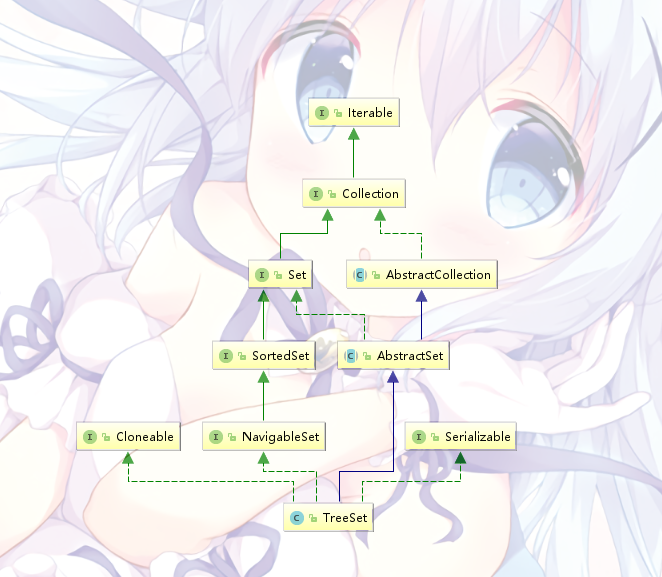

# JAVA集合-Set

Set这个词的意义和Collection很像

Set所表示的是一个无序、不重复的元素集合，公共接口继承Collection之后并没有增加新的方法，所以看起来是java集合里最简单的一个数据结构

Set常用的实现类有HashSet和TreeSet

# HashSet

HashSet的底层是一个哈希表——这样认为对也可以认为不对也行

因为HashSet的内部其实是一个HashMap，平时所有的操作都由HashSet调用HashMap的相关方法执行


```java
    private transient HashMap<E,Object> map;
```
HashSet的本体↑↑↑

既然HashSet其实是使用了一个HashMap，那里面的数据是怎样放的呢？这个之后会说

## 构造方法

HashSet有13个public方法，构造方法就有4个：

```java
    public HashSet() {
        map = new HashMap<>();
    }

    public HashSet(Collection<? extends E> c) {
        map = new HashMap<>(Math.max((int) (c.size()/.75f) + 1, 16));
        addAll(c);
    }

    public HashSet(int initialCapacity, float loadFactor) {
        map = new HashMap<>(initialCapacity, loadFactor);
    }

    public HashSet(int initialCapacity) {
        map = new HashMap<>(initialCapacity);
    }

    /**
     * 这个构造方法是给LinkedHashSet调用的
     * LinkedHashSet也有一个LinkedHashMap
     */
    HashSet(int initialCapacity, float loadFactor, boolean dummy) {
        map = new LinkedHashMap<>(initialCapacity, loadFactor);
    }
```
构造方法平平常常，HashSet也有一个负载因子

## 插入 & 删除

HashSet的插入、删除方法都只有一行代码：

```java
    public boolean add(E e) {
        return map.put(e, PRESENT)==null;
    }

    public boolean remove(Object o) {
        return map.remove(o)==PRESENT;
    }
```
直接调用了map里的put和remove方法

这时会发现这俩方法里有一个常量*PRESENT*，它的定义是这样的

```java
    private static final Object PRESENT = new Object();
```

刚才提到过，既然HashSet其实是使用了一个HashMap，那里面的数据是怎样放的

答案很明显了，HashSet用一个空的Object类作为常量，每次都填入map的value集合中，我们平时用的HashSet，其实用的是HashMap的KeySet

```java
    /**
     * Returns an iterator over the elements in this set.  The elements
     * are returned in no particular order.
     *
     * @return an Iterator over the elements in this set
     * @see ConcurrentModificationException
     */
    public Iterator<E> iterator() {
        return map.keySet().iterator();
    }
```
HashSet的迭代器↑↑↑

因此，很明显HashSet的元素可以为null，但是只有一个，因为元素不能重复

## 其他

其实，HashSet的类里面所有的public方法都只有一行，都是调用了map里对应的方法

基本上HashMap搞懂了HashSet可以直接上手了

# TreeSet

和HashSet一样，TreeSet实际上也是使用了一个Map，这个Map是NavigableSet（目前其实就是TreeMap，因为只有这一个实现类



可以看到，TreeSet和TreeMap的继承关系也是差不多的

TreeSet只有两个成员变量（排除掉*serialVersionUID*：
```java
    private transient NavigableMap<E,Object> m;

    private static final Object PRESENT = new Object();
```
一个是*NavigableMap*一个是用来填充value的Object常量

和HashMap一样，TreeSet的大部分方法都是只有一行调用TreeMap相应方法的代码

TreeMapOK了TreeSet也基本上OK了


