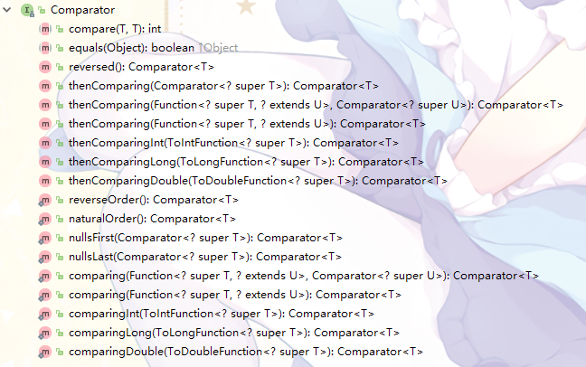

# JAVA  集合

## 总览
Java集合可大致分为四类：List、Set、Queue、Map

**List** ：List表示一个有序、可重复的元素集合，线性结构

**Queue**：类似于List，但Queue表示一个FIFO的队列结构

**Set**：字面意思，表示一个集合，Set中的元素不能重复

**Map**：保存具有映射关系的元素的集合，包含一个key和一个value，由key映射到value。Map中，key不允许重复

---

## 类结构图


*看看大致有个印象就好*

---

## 接口

#### Iterable

直译为可迭代的，

为Collection接口的直接父类

里面的三个方法：
```java
    /**
     * 返回一个集合的迭代器
     */
    Iterator<T> iterator();
    
    /**
     * 便利操作，Consumer接口相关这里不讲
     */
    default void forEach(Consumer<? super T> action) {
        Objects.requireNonNull(action);
        for (T t : this) {
            action.accept(t);
        }
    }

    /**
     * 返回一个并行迭代器Spliterator
     */
    default Spliterator<T> spliterator() {
        return Spliterators.spliteratorUnknownSize(iterator(), 0);
    }
```

实现了该接口的类就代表它具有了迭代里边元素的能力，通过*iterator()*方法获得对象的迭代器，迭代里面的元素

#### Collection

Java集合类里所有（大概。。）List、Set、Queue集合类的父类

Collection接口的唯一顶头上司是Iterable接口

↑↑↑这也代表了集合类（不包括Map）都有迭代能力


Collection接口里包含的方法

可以看到*size()*啊*isEmpty()*啊*contains(Object o)*啊*add(E e)*、*remove(Object o)*之类平时常用的方法都齐了

#### List

Collection的直接子类之一

刚刚说过的，List表示一个有序、可重复的元素集合，线性结构


Collection接口里的方法↑↑↑，大部分方法其实是Override了Collection里的方法

比起Collection，List多了*get(int index)*、*set(int index, E element)*、*add(int index, E element)*、*remove(int index)*、*indexOf(Object o)*等一堆方法

会发现，多出来的这些方法，都是和index有关的。之前说的List是一个有序的集合，因此可以直接通过index对集合进行操作，嗯……看起来方便了不少

#### Queue

又是Collection的直接子类之一


一眼就能看出，Queue接口里的方法，大部分都和队列有关↓↓↓

*Queue：类似于List，但Queue表示一个FIFO的队列结构*

个人觉得，栈应该和Queue的关系更近一些，然而Java里头的Stack，父类是List接口OTZ

#### Set

双是Collection的直接子类之一


嗯……会发现，Set接口里Override的方法，不如说Set集合的操作，和Collection的操作一毛一样

来，Set的性质是怎样的？ 一个无序的，不允许出现重复元素的结合

Collection呢？

所以说这俩接口没啥区别（我一开始还想着会不会有一堆东西要敲来着。。

#### Map

Map，不是Collection的子类

Map和Colleciton没有半毛钱关系（大概

Map存储的是一个键值对(key-value)，由key映射到value，由一个个键值对作为元素保存在Map这个集合中


Map里面也有最基本的*size*、*isEmpty*、*containsKey/Value*、*get*、*put*这些方法，同时也有了很多Map特有的操作

同时，也可以看到Map接口里有一个内部类Entry：


一个Entry便是Map里边的一个键值对

Map接口里就有一个*entrySet*方法返回这个Map的所有entry的Set集合，Entry接口里也提供了*getKey*、*getValue*、*setValue*等方法

会发现Entry里唯独没有*setKey*，也就说明了Map集合使用的key不应该是可变的，也不应该用可变对象来作为key

---

## 比较

集合类在对元素操作的时候，有些涉及到元素之间的比较（比如PriorityQueue的堆

一般情况下Java有两个接口提供了比较功能：Comparable和Comparator

#### Comparator

一个比较器接口


里头只有一个compare方法是需要自己重写的

同时，接口的定义：
```java
@FunctionalInterface
public interface Comparator<T> 
```
嗯…………Comparator是一个函数式接口

即只需要写一个类实现该接口，重写里头的compare方法，就能实现一个比较器

#### Comparable

一个比较接口

```java
public interface Comparable<T> {
    /**
     * @return  a negative integer, zero, or a positive integer as this object
     *          is less than, equal to, or greater than the specified object.
     */
    public int compareTo(T o);
}
```

一个类实现了该接口之后，类的俩对象a、b需要比较时，直接*a.compareTo(b)*

这个方法jdk建议返回-1、0、1

---

## 其他

#### AbstractCollection

实现了Collection接口的抽象类

实现了Collection接口里的大部分方法

#### 为什么集合类没有实现Cloneable和Serializable接口

集合类并不是没有实现Cloneable和Serializable接口。因为两个接口的实现需要具体的类，因此需要由集合类的具体实现来决定如何Cloneable和Serializable
