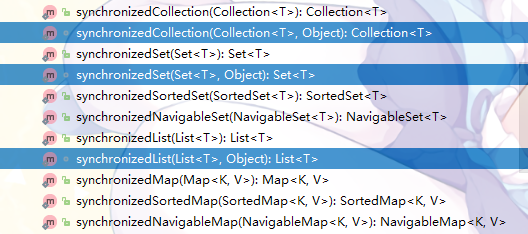

# Java集合的线程安全性

我们平时用的各种*ArrayList*、*ArrayDeque*、*HashMap*、*HashSet*之类的集合工具类，都不是线程安全的。在它们在多线程环境下使用的时候随时可能会BOOM

当然，如果是List和Map的话你可以选择*Vector*、*Hashtable*这俩支持多线程同步的类

# Collections类的包装方法

正常情况下，这样子声明的一个集合是不支持线程安全的（废话）：

```java
    List list = new ArrayList();
```

*Collections*类中，提供了将普通的集合包装转换为线程安全的集合的方法，这样操作：

```java
    List list = new ArrayList();

    List syncList = Collections.synchronizedList(list);
```

现在，syncList就是一个线程安全的List了

同理，Set、Map等都可以这样转换为线程安全的集合，*Collections*提供了如下方法：


就以刚才的List为例，看下这个方法究竟是怎样的：

```java
    public static <T> List<T> synchronizedList(List<T> list) {
        return (list instanceof RandomAccess ?
                new SynchronizedRandomAccessList<>(list) :
                new SynchronizedList<>(list));
    }
```

这里看到，根据传进来的*List*里有没有实现*RandomAccess*接口，分别返回了一个类。其实，看到*return new Xxxx()*心里都有些眉目了


*Collections*工具类里有这么多包装类↑↑↑

*ArrayList*是实现了*RandomAccess*接口的，去看一下*SynchronizedRandomAccessList*类是怎样的：

```java
 static class SynchronizedRandomAccessList<E>
        extends SynchronizedList<E>
        implements RandomAccess {

        SynchronizedRandomAccessList(List<E> list) {
            super(list);
        }

        SynchronizedRandomAccessList(List<E> list, Object mutex) {
            super(list, mutex);
        }

        public List<E> subList(int fromIndex, int toIndex) {
            synchronized (mutex) {
                return new SynchronizedRandomAccessList<>(
                    list.subList(fromIndex, toIndex), mutex);
            }
        }

        private static final long serialVersionUID = 1530674583602358482L;

        private Object writeReplace() {
            return new SynchronizedList<>(list);
        }
    }
```

发现它继承了*SynchronizedList*，但是并没有什么特别的。*subList(int fromIndex, int toIndex)* 重写了父类的方法（这里看不出来，IDEA上标记了）。去看看父类是怎样的：

```java
static class SynchronizedList<E>
        extends SynchronizedCollection<E>
        implements List<E> {
        private static final long serialVersionUID = -7754090372962971524L;

        final List<E> list;

        SynchronizedList(List<E> list) {
            super(list);
            this.list = list;
        }
        SynchronizedList(List<E> list, Object mutex) {
            super(list, mutex);
            this.list = list;
        }

        public boolean equals(Object o) {
            if (this == o)
                return true;
            synchronized (mutex) {return list.equals(o);}
        }
        public int hashCode() {
            synchronized (mutex) {return list.hashCode();}
        }
        public E get(int index) {
            synchronized (mutex) {return list.get(index);}
        }
        public E set(int index, E element) {
            synchronized (mutex) {return list.set(index, element);}
        }
        public void add(int index, E element) {
            synchronized (mutex) {list.add(index, element);}
        }
        public E remove(int index) {
            synchronized (mutex) {return list.remove(index);}
        }
        public int indexOf(Object o) {
            synchronized (mutex) {return list.indexOf(o);}
        }
        public int lastIndexOf(Object o) {
            synchronized (mutex) {return list.lastIndexOf(o);}
        }
        public boolean addAll(int index, Collection<? extends E> c) {
            synchronized (mutex) {return list.addAll(index, c);}
        }
        public ListIterator<E> listIterator() {
            return list.listIterator(); // Must be manually synched by user
        }
        public ListIterator<E> listIterator(int index) {
            return list.listIterator(index); // Must be manually synched by user
        }
        public List<E> subList(int fromIndex, int toIndex) {
            synchronized (mutex) {
                return new SynchronizedList<>(list.subList(fromIndex, toIndex), mutex);
            }
        }
        @Override
        public void replaceAll(UnaryOperator<E> operator) {
            synchronized (mutex) {list.replaceAll(operator);}
        }
        @Override
        public void sort(Comparator<? super E> c) {
            synchronized (mutex) {list.sort(c);}
        }
        private Object readResolve() {
            return (list instanceof RandomAccess
                    ? new SynchronizedRandomAccessList<>(list)
                    : this);
        }
    }
```

为了代码完整性这里就不做删减了

追到这里已经差不多明了了，其实*SynchronizedList*将我们传进去的list保存在了自己的成员变量中。*SynchronizedList*基本上所有的操作都是直接调用原来list的方法，只不过使用*synchronized*关键字把它包在了同步块中

而且，这不就是代理模式吗！！！！！！

所以，我们的*Collections.synchronizedList(xxx)*就是给我们返回了一个代理类，通过这个代理类去调用xxx集合，保证多线程同步

---

接下来是*Collections*里头的包装类怎么保证同步的，这里自己也没摸太清，简单说下：

可以看到包装类里的*synchronized*关键字都是给一个叫做*mutex*的变量加了锁，这个变量可以是调用*SynchronizedList(List list, Object mutex)*构造方法的时候传入——很遗憾我们不能调用这个构造方法↓↓↓



能去调用那个构造方法的包装方法是包可见的

既然我们不能自己传，*mutex*又已经被定义了。那就看下*mutex*变量从哪来的，*SynchronizedList*中我们并没有看到它的定义，于是去找父类*SynchronizedCollection*，在这我们看到了它：

```java
    final Collection<E> c;  // Backing Collection
    final Object mutex;     // Object on which to synchronize

    SynchronizedCollection(Collection<E> c) {
        this.c = Objects.requireNonNull(c);
        mutex = this;
    }

    SynchronizedCollection(Collection<E> c, Object mutex) {
        this.c = Objects.requireNonNull(c);
        this.mutex = Objects.requireNonNull(mutex);
    }
```

也就是说默认情况下，*mutex = this*

接下来就很清晰了：包装类里的方法，*synchronized*关键字是给当前包装类的对象加的锁

---

这里仅仅是以List作为说明，其实其他包装类和包装方法都大同小异了

# ConcurrentHashMap

> 因为从jdk1.7到jdk1.8，ConcurrentHashMap的改动相当大，这里都以jdk1.8来展开

ConcurrentHashMap是jdk1.5开始提供的一个支持多线程同步的HashMap容器，性能上比Hashtable这种古董货高好几个华莱士

简单来说，**ConcurrentHashMap保证多线程同步的机制是依靠*CAS*和*synchronized*关键字**

## 本体

```java
    transient volatile Node<K,V>[] table;

    static class Node<K,V> implements Map.Entry<K,V> {
        final int hash;
        final K key;
        volatile V val;
        volatile Node<K,V> next;
    }
```

和HashMap一样，ConcurrentHashMap也是由一个Node数组组成的

在正常情况下，ConcurrentHashMap都是用链地址法处理冲突，*table*的每一个节点都是一个链表。当链表长度>8时，就会转换为红黑树

## 初始化

ConcurrentHashMap的构造方法使用上和HashMa差不多，属于一看签名就会用的那种

## hash


## 同步控制

之前简单的提到过，ConcurrentHashMap保证多线程同步的机制是依靠*CAS*和*synchronized*关键字


