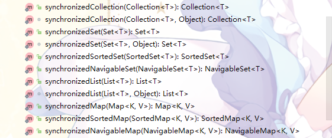

# Java集合的线程安全性

我们平时用的各种*ArrayList*、*ArrayDeque*、*HashMap*、*HashSet*之类的集合工具类，都不是线程安全的。在它们在多线程环境下使用的时候随时可能会BOOM

当然，如果是List和Map的话你可以选择*Vector*、*Hashtable*这俩支持多线程同步的类

# Collections类的包装方法

正常情况下，这样子声明的一个集合是不支持线程安全的（废话）：

```java
    List list = new ArrayList();
```

*Collections*类中，提供了将普通的集合包装转换为线程安全的集合的方法，这样操作：

```java
    List list = new ArrayList();

    List syncList = Collections.synchronizedList(list);
```

现在，syncList就是一个线程安全的List了

同理，Set、Map等都可以这样转换为线程安全的集合，*Collections*提供了如下方法：



就以刚才的List为例，看下这个方法究竟是怎样的：

```java
    public static <T> List<T> synchronizedList(List<T> list) {
        return (list instanceof RandomAccess ?
                new SynchronizedRandomAccessList<>(list) :
                new SynchronizedList<>(list));
    }
```

这里看到，根据传进来的*List*里有没有实现*RandomAccess*接口，分别返回了一个类。其实，看到*return new Xxxx()*心里都有些眉目了。