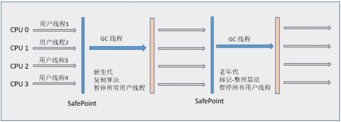

# 找垃圾

## 引用计数算法

给对象上一个引用计数器，每当有一个地方引用时，计数器+1，引用失效时-1

如果一个对象的引用计数器为0代表对象已经不能被使用了

缺点：

```java
public class Test {

    Object reference;

    public static void main(String[] args) {
        
        Test t1 = new Test();
        Test t2 = new Test();
        
        t1.reference = t2;
        t2.reference = t1;
        
        t1 = null;
        t2 = null;
    
        System.gc();
    }
}
```

你打我呀.jpg

## 可达性分析算法

思路就是通过一系列“GC Roots”对象作为起点，从这些对象的引用开始向下收搜索，所走过的路径成为引用链。当一个对象不在引用链，或者说GC Roots到这个对象不可达时，这个对象就是垃圾

可作为GC Roots的有这些：

* 类的Class对象

* 虚拟机栈中引用的对象

* 方法区中静态属性引用的对象

* 常量池中引用的对象

* 本地方法栈中引用的对象

## 回收方法区

方法区主要回收两种东西：废弃常量和无用的类

#### 废弃常量

判断一个常量废弃比较简单，和Java堆中的对象比较相似

只要一个常量没有被引用了，就有可能被GC

#### 无用类

判断一个类是无用的类需要下面仨条件：

* 类的所有实例都被GC

* 加载该类的ClassLoader也被回收

* 该类对应的Class变量没有被任何地方引用

满足这仨条件的类**可以**回收

# 关于引用

jdk1.2以前引用的定义比较直接：引用类型的值代表了另外一块内存的地址，那就代表着一个引用。一个对象只有被引用和未被引用两种状态

1.2之后，Java对引用概念进行了扩充，变成了强引用、软引用、弱引用、虚引用4种

## 强引用

比如*Object o = new Object()*

只要强引用还在，就永远不会被GC

## 软引用

描述一些还有用但并非必须的对象

软引用关联着的对象，系统要发生内存溢出前，会把这些对象放入回收范围内进行二次回收。若回收完还是没有足够内存，才会发生内存溢出

由*SoftReference*类来实现软引用

## 弱引用

弱引用的强度比软引用还要更弱一些

弱引用关联的对象只能活到下一次GC之前。GC时无论内存是否足够，都会回收掉只有弱引用关联的对象

由*WeakReference*类来实现软引用

## 虚引用

又叫幽灵引用or幻影引用，最弱的一种引用关系

一个对象是否有虚引用存在，对它的生存周期没有任何影响，也无法通过虚引用获取一个实例。为一个对象设置虚引用的唯一目的就是能在这个对象被GC时能收到通知

由*PhantomReference*类来实现软引用

# 垃圾收集算法

## 标记-清除算法

算法分为标记、清除俩阶段：先标记出所有需要回收的对象，标记完成后统一回收

缺点：

标记和清除过程的效率不高。主要是，完成后会产生大量不连续的内存碎片

## 复制算法

将可用内存按容量分为两块，每次只使用其中一块。当这块内存用完了，就将活着的对象复制到另一块上面，再把已经使用过的内存空间一次清理掉

缺点：浪 费 空 间

一般情况下复制算法把空间分为一块Eden区和两块Survivor区，Eden:Survivor=8:1。每次使用Eden和一块Survivor，GC时，将它们中存活的对象移到另一块Survivor区，然后清理掉Eden和刚使用的Survivor区。接下来使用Eden和刚刚的另一块Survivor区

之所以能这样做，是因为大部分情况下，Java堆大部分情况下的对象都是朝生夕灭的

## 标记-整理算法

标记过程和标记清除算法一样，后续步骤则是让所有存活的对象都向一端移动，然后直接清理掉端边界以外的内存

## 分代收集算法

根据对象的存活周期将内存分为几块，一般是把Java堆分为新生代和老年代

新生代的对象基本上都是朝生暮死，使用刚才提到的复制算法，分为一块Eden区和两块Survivor区

老年代的存活率较高，一般使用其他两种算法GC

> * Minor GC——新生代GC
> * Full GC——老年代GC


# 垃圾收集器

垃圾收集器主要分成两类：新生代收集器和老年代收集器

同时，新生代收集器和老年代收集器之前有兼容性问题


这是不同收集器的兼容关系图

首先是新生代收集器

## Serial收集器

Serial收集器是最老资历的收集器

使用复制算法

它是单线程的，并且工作（GC）时必须暂停用户线程的工作

不过简单高效



## ParNew收集器

Serial收集器的多线程版本

不过还GC时是要暂停用户线程的工作


## Parrallel Scavenge收集器

新生代收集器（ParNew收集器+1

用复制算法（ParNew收集器+1

多线程收集器（ParNew收集器+1

Parrallel Scavenge收集器最大特点是它关注**吞吐量**，其他收集器关注的是缩短GC时用户线程停顿时间

Parrallel Scavenge收集器也称为“吞吐量优先”收集器

> 吞吐量 = 用户线程运行时间 / (用户线程运行时间 + GC时间)

--- 

接下来是老年代的收集器

## Serial Old收集器

Serial收集器的老年代版本

使用标记-整理算法

## Parallel Old收集器

Parrallel Scavenge收集器的老年代版本

使用标记-整理算法


## CMS收集器

CMS收集器是一种以获取最短回收停顿时间为目标的收集器

使用标记-清除算法

所以这货很容易留空间碎片↑↑↑

CMS收集器的GC过程分为四步：

* 初始标记：仅仅标记一下GC Roots能直接关联到的对象
* 并发标记：真正进行引用链追踪的地方
* 重新标记：修正上一步因为用户线程导致变动的标记记录
* 并发清理：？

 CMS收集器的**并发标记**和**并发清理**阶段是和用户线程并发的！

 因此CMS的系统停顿比其他收集器要好，用户体验会更高


