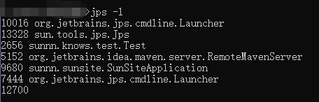
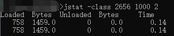
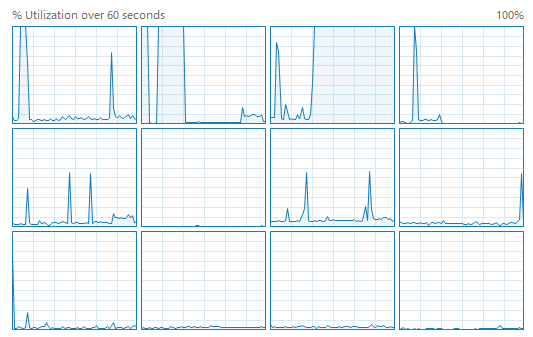
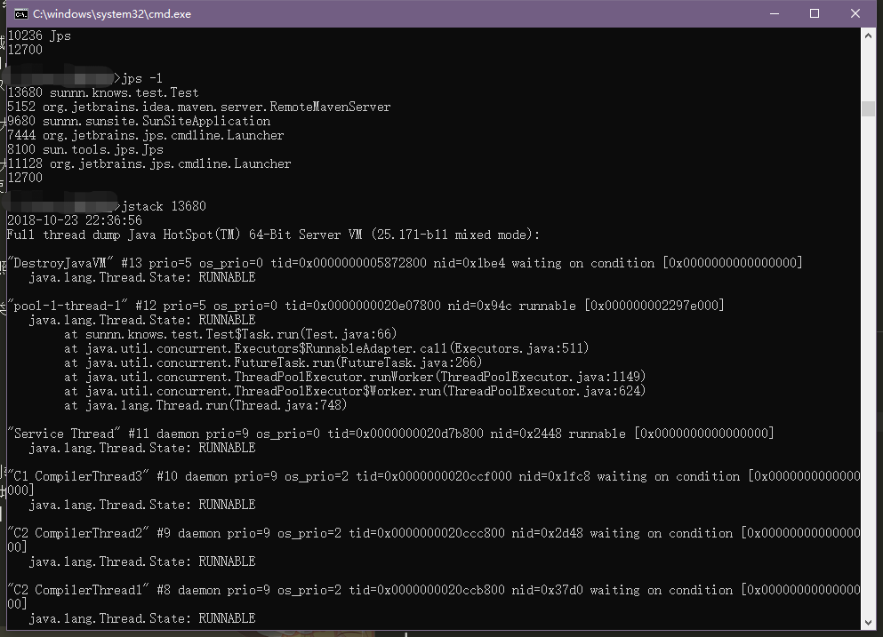
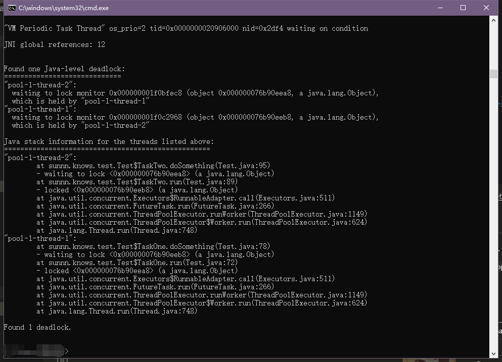
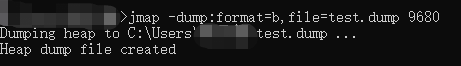
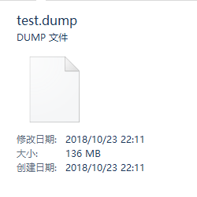

# jps

列出正在运行的虚拟机进程，并显示虚拟机执行主类名称及这些进程的本地虚拟机ID（LVMID

基本上其他JDK工具都需要jps查询到的LVMID来确定是哪一个进程

> jps [-q] [\<hostid>]



## 选项

| 选项 | 作用 |
| ---- | ---- |
| -q | 只输出LVMID |
| -m | 输出JVM进程启动时传给*main()*函数的参数 |
| -l | 输出主类全名，如果进程执行的是Jar包则输出Jar路径 |
| -v | 输出JVM进程启动时的JVM参数 |

# jstat

用于监视虚拟机各种运行状态信息的工具，比如虚拟机进程中的类装载、内存、GC、JIT编译等数据

> jstat [option vmid [interval[s|ms] [count]]]

* [interval[s|ms]：代表查询的间隔
* [count]：代表查询的次数



查询2656进程的类加载情况2次，间隔1s

## 选项

| 选项 | 作用 |
| ---- | ---- |
| -class | 监视类装载情况 |
| -compiler | 输出JIT编译器编译过的方法 |
| -printcompilation | 输出已经被JIT编译的方法 |
| -gc | 监视Java堆情况 |
| -gccapacity | 侧重于Java堆中各区域使用到的最大、最小空间 |
| -gcutil | 侧重于Java堆中已使用空间占总空间的百分比 |
| -gccause | 在-gcutil基础上输出导致上一次GC的原因 |
| -gcnew | 监视新生代GC情况 |
| -gcnewcapacity | 侧重于使用到的最大、最小空间 |
| -gcold | 监视老年代GC情况 |
| -gcoldcapacity | 侧重于使用到的最大、最小空间 |
| -gcmetacapacity | 输出Metaspace使用到的最大、最小空间 |

# jstack

jstack可以生成虚拟机当前时刻的线程快照

这个工具很适合用来排查死循环or死锁之类的

> jstack [option] vmid

## 选项

| 选项 | 作用 |
| ---- | ---- |
| -F | 若正常输出的请求没有响应，强制输出线程堆栈 |
| -m | 若调用到本地方法，限时C/C++的堆栈 |
| -l | 除堆栈外，显示出关于锁的信息 |

## demo

#### 死循环

模拟一个死循环的定位：

假设我们的 *++v*给错写成了 *--v*造成一个死循环

```java
public class Test {

    public static void main(String[] args) {
        ExecutorService pool = Executors.newFixedThreadPool(2);

        Task t = new Task();
        pool.submit(t);
    }

    static class Task implements Runnable {
        @Override
        public void run() {
            long v = 0;

            while (v <= 0)
                --v;
        }
    }
}
```



意料之中的CPU有一个核心跑满了



首先通过*jps -l*获取运行进程的id，然后通过jstack去查看

可以很直观的看到程池中名为*pool-1-thread-1*的一个线程。通过堆栈信息可以很方便的定位到死循环的代码所在处

**注：这里只是过家家式的演示，生产环境下应该是先定位到异常的线程，然后再通过jstack去找到对应线程查看堆栈**

## 死锁

我们先手动实现一个死锁：

```java
public class Test {

    private static final Object o1 = new Object();

    private static final Object o2 = new Object();

    public static void main(String[] args) {
        ExecutorService pool = Executors.newFixedThreadPool(2);

        TaskOne t1 = new TaskOne();
        TaskTwo t2 = new TaskTwo();
        pool.submit(t1);
        pool.submit(t2);
    }

    static class TaskOne implements Runnable {
        @Override
        public void run() {
            synchronized (o1) {
                sleepDown();

                doSomething();
            }
        }

        private void doSomething() {
            synchronized (o2) {
                System.out.println("Hello World");
            }
        }
    }

    static class TaskTwo implements Runnable {
        @Override
        public void run() {
            synchronized (o2) {
                sleepDown();

                doSomething();
            }
        }

        private void doSomething() {
            synchronized (o1) {
                System.out.println("Hello World");
            }
        }
    }

    private static void sleepDown() {
        try {
            Thread.sleep(20);
        } catch (InterruptedException e) {
            e.printStackTrace();
        }
    }
}
```

运行之后也是通过jps获取进程id，然后使用jstack查看：



可以发现jstack已经很智能的帮我发现了死锁的情况

# jinfo

实时查看、调整虚拟机的各项参数

> jinfo [option] pid

## 选项

| 选项 | 作用 |
| ---- | ---- |
| -flag \<name> | 查询指定的参数值 |
| -flag [+|-]<name> | enable或者disable指定的参数 |
| -flag <name>=<value> | 修改指定的参数 |
| -flags | 输出全部的参数 |
| -sysprops | 打印系统参数 |

如果不加任何选项的话，会默认输出上边所有的内容（后俩个

顺便，jinfo只能修改一部分运行期可改的数值

# jmap

jmap命令可以生成堆转储快照、查询finalize执行队列、Java堆和永久代信息等

jmap生成的dump快照文件，可以在jhat或者MemoryAnalyzer或者VisualVM等分析dump文件

> jmap [option] pid



使用jmap生成一个快照



生成的快照文件

## 选项

| 选项 | 作用 |
| ---- | ---- |
| -dump | 格式：-dump:[live,]format=b,file=\<filename> 生成堆转储快照。其中live子参数制定是否只dump出存活的对象 |
| -histo | 显示堆中的对象统计信息，比如类、实例数量、合计容量 |
| -heap | 显示Java堆详细信息，如使用哪种收集器、参数配置、分代状况等 |
| -F | 虚拟机进程对-dump选项无响应时，可用它强制生成dump快照 |
| -finalizerinfo | 显示在F-Queue中等待Finalizer线程执行finalizer方法的对象 |
| -permstat | 以ClassLoader为统计口径显示永久代内存状态 |

上面的选项中，只有前两个选项能在Windows中使用


