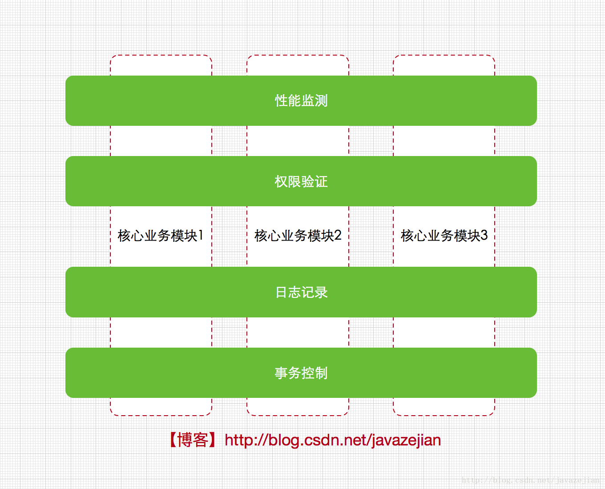

# Why AOP

日常开发中，我们经常会碰到一些相似的业务逻辑：日志记录、权限验证、数据校验等。这些业务非常相似，但是又必不可少。

因此可以把这些相似的业务，分别放到一起，一种业务作为一个关注点，关注点与原有的业务分离，作为单独的业务模块，横切原有的业务。这种关注点叫做横切关注点（图片出处见水印

这就是AOP面向切面编程。

# 术语

## Aspect

切面，切面由Advice和Pointcut组成

## Advice

通知

通知定义了切面什么时候使用，以及要做什么。简单来说就是用于增强的代码。

通知有5种：

* Before —— 在方法调用之前通知
* After —— 方法完成之后通知
* AfterReturning —— 方法成功执行之后通知
* AfterThrowing —— 方法丢异常后通知
* Around —— 通知包裹了被通知的方法，可以在方法调用前调用后做一些操作    

## Joinpoint

连接点

程序运行中的一些时间点，对于Spring AOP来说就是程序代码里的方法的执行

## Pointcut

切点

指定哪一些连接点该被切

对于Spring AOP来说就是要提供一个规则指定哪些方法需要执行通知

## Introduction

引入

为一个类型添加额外的方法或字段

## Weaving

织入

将切面应用到目标对象，生成代理对象的过程（AOP本质上就是个代理模式）

## Target

目标对象

就是织入得到的代理对象。这个对象已经不是原来的对象了，而是增加了通知增强之后的对象（参考代理模式）
