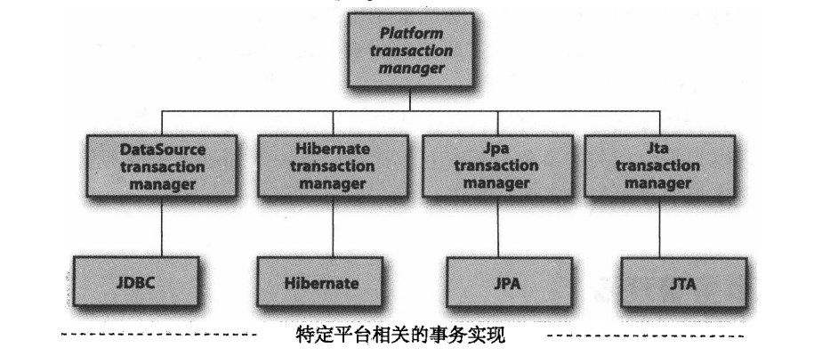
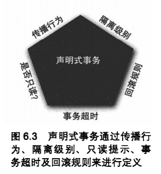

# Spring事务管理器

Spring不直接管理事务，但是提供了多种事务管理器。它们将事务管理的任务委托给它们对应的持久层框架。

这里是其中一部分常用的事务管理器↓↓↓（图片来自《Spring实战》



除了上面这4个还有很多很多……

每个事务管理器都充当它对应平台的门面，用户使用Spring事务时，几乎不用关心实际事务是怎样的

## PlatformTransactionManager

*PlatformTransactionManager*是所有事务管理器的父类

```java
public interface PlatformTransactionManager {
    TransactionStatus getTransaction(@Nullable TransactionDefinition var1) throws TransactionException;

    void commit(TransactionStatus var1) throws TransactionException;

    void rollback(TransactionStatus var1) throws TransactionException;
}
```

可以看到它只有三个方法

## TransactionDefinition

*TransactionDefinition*接口中代表了事务的定义，或者说属性

```java
public interface TransactionDefinition {
    int PROPAGATION_REQUIRED = 0;
    int PROPAGATION_SUPPORTS = 1;
    int PROPAGATION_MANDATORY = 2;
    int PROPAGATION_REQUIRES_NEW = 3;
    int PROPAGATION_NOT_SUPPORTED = 4;
    int PROPAGATION_NEVER = 5;
    int PROPAGATION_NESTED = 6;
    int ISOLATION_DEFAULT = -1;
    int ISOLATION_READ_UNCOMMITTED = 1;
    int ISOLATION_READ_COMMITTED = 2;
    int ISOLATION_REPEATABLE_READ = 4;
    int ISOLATION_SERIALIZABLE = 8;
    int TIMEOUT_DEFAULT = -1;

    int getPropagationBehavior();

    int getIsolationLevel();

    int getTimeout();

    boolean isReadOnly();

    @Nullable
    String getName();
}
```

可以看到里面有很多常量，这些常量会在下面的事务属性中讲到

## TransactionStatus

*TransactionStatus*接口记录了事务状态

```java
public interface TransactionStatus extends SavepointManager, Flushable {
    boolean isNewTransaction();

    boolean hasSavepoint();

    void setRollbackOnly();

    boolean isRollbackOnly();

    void flush();

    boolean isCompleted();
}
```

通过方法名可以直接看懂方法是做什么的

# 事务属性

（图片依旧来自《Spring实战》



## 隔离级别

Spring中的隔离级别和关系数据库中的一样，但是多了一个默认级别：

| 隔离级别 | 说明 | 
| ---- | ---- |
| ISOLATION_DEFAULT | 使用数据库默认的隔离级别 |
| ISOLATION_READ_UNCOMMITTED | 和关系型数据库中的定义一致 |
| ISOLATION_READ_COMMITTED |  |
| ISOLATION_REPEATABLE_READ |  |
| ISOLATION_SERIALIZABLE |  |

## 事务传播行为

事务的传播行为主要是当前的事务方法调用另一个事务方法时，事务应该如何传播。

比如A事务方法调用B事务方法后，B方法是在A方法的事务中运行，还是自己开一个事务这样

| 传播行为 | 说明 | 
| ---- | ---- |
| PROPAGATION_REQUIRED | 方法必须运行在事务中。如果当前事务存在，方法就在该事务中运行。如果不存在，就启动一个新事务。**它是Spring默认的传播行为** |
| PROPAGATION_SUPPORTS | 方法不需要事务上下文。若存在当前事务，方法会在这个事务中运行 |
| PROPAGATION_MANDATORY | 方法必须在事务中运行。若当前事务不存在，就会丢异常 |
| PROPAGATION_REQUIRES_NEW | 方法必须运行在自己的事务中。即，就算当前事务存在，也会自己新建一个事务，当前事务就会被挂起 |
| PROPAGATION_NOT_SUPPORTED | 方法不应该运行在事务中。即，如果当前事务存在，方法就会把它挂起，自己不在事务中运行 |
| PROPAGATION_NEVER | 方法不应该运行在事务中。若当前事务存在，就会丢异常 |
| PROPAGATION_NESTED | 如果当前已经存在一个事务了，那该方法会在嵌套事务中运行。嵌套事务可以独立于当前事务，可以单独提交或回滚。若当前事务不存在，就像PROPAGATION_REQUIRED一样启动一个新事务 |

前面三个传播行为都是**支持当前事务**

接下来仨都是**不支持当前事务**

注意是 当 前 事 务 ↑↑↑

前六种传播行为都是和EJB中的定义是一样的。最后一种*PROPAGATION_NESTED*是Spring特有的

## 事务超时

一个事务允许执行的时间，如果超过该时间事务还没有完成，自动回滚事务

单位是s

## 只读

对事务性资源进行只读操作or读写操作

## 回滚规则

默认配置下，会自动回滚*RuntimeException*异常和*Error*异常

当然，可以自己配置

# @Transactional 

对的这里只写声明式事务。因为编程式事务我压根没用过

## Spring下XML的配置

只需两步（首先需要配好数据源），定义事务管理器（这里以DataSourceTransactionManager作为例子：

```xml
<bean id="transactionManager"                   
        class="org.springframework.jdbc.datasource.DataSourceTransactionManager"> 
    <property name="datasource" ref="datasource" /> 
</bean>
```

然后通过定义注解驱动开启注解开关：

```xml
<tx:annotation-driven transaction-manager="transactionManager"/>
```

就能开心的用 *@Transactional*定义事务了

除了通过定义注解驱动这种方法，还有像通过tx命名空间定义切面等方法，不过自己也没有用过，这里不写

## Spring Boot下的配置

如果引入了spring-boot-starter-jdbc依赖，Spring Boot会自动注入*DataSourceTransactionManager*

如果引入了spring-boot-starter-data-jpa依赖，Spring Boot会自动注入*JpaTransactionManager*

大部分情况下，我们什么都不用做就可以直接使用 *@Transactional*

*多事务管理器的情况下自己并没有试过，这里先留坑*

## @Transactional的参数

| 参数 | 类型 | 默认值 | 说明 | 
| ---- | ---- | ---- | ---- |
| value/transactionManager | String | "" | 指定使用哪一个事务管理器 |
| propagation | Propagation | Propagation.REQUIRED | 传播行为 |
| readOnly | boolean | Isolation.DEFAULT | 是否是只读事务 |
| timeout | int | -1(+∞) | 超时时间 |
| rollbackFor | Class<? extends Throwable>[] |  | 会导致事务回滚的异常类 |
| rollbackForClassName | String[] |  | 会导致事务回滚的异常类名 |
| noRollbackFor | Class<? extends Throwable>[] |  | 不会导致事务回滚的异常类 |
| noRollbackForClassName | String[] |  | 不会导致事务回滚的异常类名 |

## demo

```java
    @Transactional(value = "transactionManager",    // Spring Boot默认为我们注入的事务管理器就叫这个
            propagation = Propagation.REQUIRED,
            isolation = Isolation.DEFAULT,
            readOnly = true,    // 设为只读事务。如果方法里有对数据库的读操作，会boom
            timeout = 114514,
            rollbackFor = {Exception.class},    // Exception类型的异常会回滚（跟下面冲突了
            noRollbackForClassName = {"RuntimeException"}) // RuntimeException类型的异常不会回滚
    public void service() {
        // do something...
    }
```

# 其他

Spring中的声明式事务是基于AOP。它将事务逻辑作为增强，与业务分离开来，使得业务代码不受到事务管理代码的污染。

在打上 *@Transactional*注解之后，运行时由AOP生成了一个代理对象，使用*TransactionInterceptor*作为拦截器来拦截。在进入目标方法之前创建一个事务，然后根据目标方法的执行情况，决定是提交还是回滚

因为使用了AOP，因此有很明显的一个要注意的点：一个事务方法A调用同一个类里的事务方法B，B的事务是不起作用的。同样 *@Transactional*也不能打在非*public*方法上
