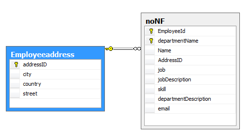
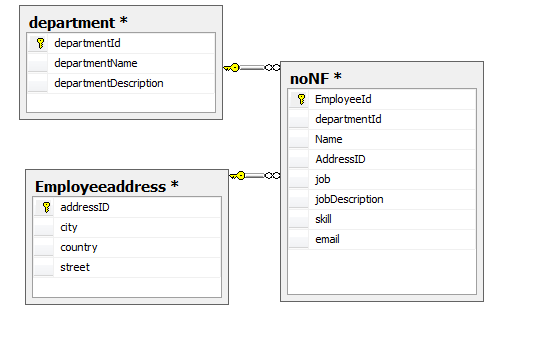
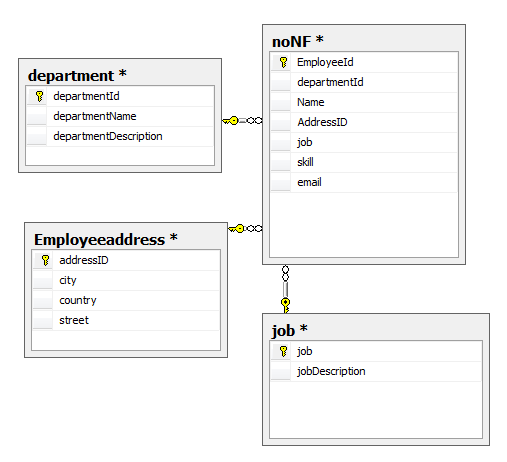

> 本篇的样例来自 https://www.cnblogs.com/CareySon/archive/2010/02/16/1668803.html

# 范式

数据库范式，我的理解是数据库表的规范化。遵守数据库范式所设计的数据库表通常都能减少数据冗余，增加数据的一致性

数据库范式从简单到严一路过去：1NF、2NF、3NF、BCNF、4NF、5NF（DKNF、6NF）

## 在此之前

先定义一个未经过范式的表（字段命名格式好乱。。：

# 第一范式

> 1NF要求数据库表中的所有字段都是单一属性，不可再分的

第一范式要求表里面的字段不可再分

上边的表中，Address可以再分，将Address拆分成详细字段放到另一个表：

# 第二范式

> 2NF在满足1NF的基础上要求表中不存在非关键字段对任一候选关键字段的部分函数依赖

简单来说，就是如果一个表里，普通字段都依赖于表里的所有主键，或者说所有主键都参与决定了每一个字段的记录，这个表就符合第二范式。

很明显，如果一个符合第一范式的表只有一个主键，那它一定满足第二范式

上边的表中，departmentDescription依赖于DepartmentName，和另一个主键没有半毛钱关系。因此departmentDescription对主键是部分依赖关系。优化：

# 第三范式

> 3NF要求表中不存在非关键字段对任一候选关键字段的传递依赖

第三范式是为了消除表内字段之间的依赖。或者说，第三范式要求表中的字段不能由其他字段派生而来，它要求字段没有冗余

可以发现刚才的表中，jobDescription是依赖于job的，而job依赖于EmployeeId，形成了一个传递依赖。这样子是不符合第三范式的。优化：

# BC范式

> 符合3NF，并且，表中不存在任何字段对任一候选关键字段的传递依赖

对BC范式最简单的理解就是，一个表中不单止普通字段不能对主键有传递依赖（3NF），主键和主键之间也不能有传递依赖

这里参考博客的样例感觉有些不恰当，就不放了

Google了一下BC范式，找到慕课网去了，样例来自 https://www.imooc.com/learn/117 ：

这个表符合3NF，但是不符合BCNF

表中存在两种决定关系：

* （供应商，商品ID） → （联系人，商品数量）
* （联系人，商品ID） → （供应商，商品数量）

因此可以得到这样的关系：

* 供应商 → 联系人
* 联系人 → 供应商

这样很明显不符合BC范式，因此需要调整

# 第四范式

要求把同一表内的多对多关系删除

# 反范式化

可以看到，通过遵守范式规则，数据库的数据冗余变得越来越少，数据一致性也越来越强。但是这也伴随着表数量的增长。有时候一个表经过范式化之后，会被拆成复数张表。导致的结果是我们随便做一个查询，都要对表做关联。而join在MySQL中的效率是绝对谈不上高的。

因此完美遵循数据库范式有时候反而会增加查询复杂度和降低查询性能。

笔者在实习的时候有这样一个项目：一个police表中保存了id和name，同时其他业务表中都包含了police_id这个字段。于是业务查询中，大部分的业务都需要把police_name同时查询出来。导致经常为了police_name这一个字段而白白多关联一张表，麻烦又更加费时。

因此有时候为了运行效率等考量，适当违反数据库范式，增加冗余字段，这就是反范式化。
