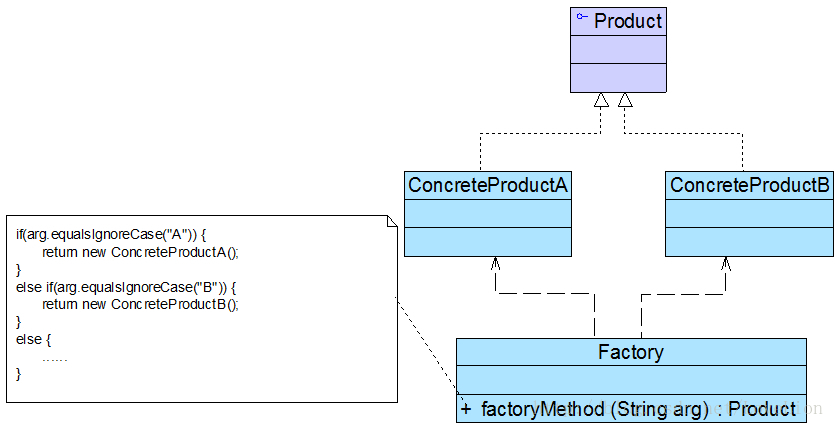

> 设计模式这一板块中的所有样例均来自程杰老师的《大话设计模式》（因为懒得自己想了），并且设计模式的定义也参zhao考chao本书。感谢程杰老师用通俗易懂的语言让自己快速了解了设计模式

> 所有图片来自 https://blog.csdn.net/LoveLion

# 简单工厂模式

> Simple Factory Pattern

简单工厂模式又叫做静态工厂模式，它是这样一个方法：根据传入的参数，返回不同的实例对象。通常情况下，这些返回的对象都是一个抽象类的子类。



## 优点

对类的实例化过程进行了抽象，将类的创建过程和业务流程分离出来，并且除去了客户端与具体产品的依赖

## 缺点

工厂方法集中了所有产品的创建，一旦工厂BOOM，整个系统都会受影响

不够灵活，每多一个具体产品，就要去修改一次工厂方法，违反开闭原则

# 工厂方法模式

> Factory Method，定义一个用于创建对象的接口，让子类决定实例化哪一个类。工厂方法使一个类的实例化延迟到其子类。

因为简单工厂方法每次修改都会违反开闭原则，并且如果客户端随便输一些非法输入也会很头疼（虽然并不会造成什么严重后果，返回个null倒霉的是客户端

使用工厂方法，客户端就根须需要的产品，选择具体的哪一个工厂。当有新的产品时，只需要新建一个对应的工厂类就ok了


## 优点

实例化产品的过程更加面向接口，客户端无需关心创建细节。
有新产品，修改的时候完全符合开闭原则。相对于简单工厂模式，可拓展性更高。

## 缺点

轮到客户端需要选择判断调用哪一个工厂了。。

# 抽象工厂模式

> AbstractFactory 提供一个创建一系列相关或互相依赖对象的接口，而无需指定它们具体的类。

抽象工厂模式为创建一组对象提供了一种解决方案。与工厂方法模式相比，抽象工厂模式中的具体工厂不只是创建一种产品，它负责创建一族产品。


## 优点

易于变换产品系列，并且很容易增加新的产品族

## 缺点

产品族增加新的产品很麻烦，要违反开闭原则

# 原型模式

> Prototype Pattern 用原型实例制定创建对象的种类，并且通过拷贝这些原型创建新的对象

原型模式可以把一个对象做克隆，复制出一份一样的新对象。Java的*clone()*方法可以看作是原型模式的一种实现。这种模式可以很方便的基于一个模板（一个对象），快速的克隆出许多一样的对象，这样就可以再分别对每个模板进行定制


## 优点

当创建一个对象比较复杂时，可以用原型模式快速的创造出新对象，可以当作一个简化版的工厂模式

## 缺点

克隆方法在类的内部，当类的结构改动时，势必会违反开闭原则。如果含有深克隆，里面的嵌套调用有可能引发雪崩式的连锁修改

# 单例模式

> Singleton Pattern 保证一个类仅有一个实例，并提供一个访问它的全局访问点。

当碰到一些特殊需求，一个类只能有一个实例的时候，单例模式就派上用场了


## 懒汉式单例

懒汉式单例指的是在自己第一次被引用时，才将自己实例化

这也是初学者常见做法（？


```java
class LazySingleton {

    private static LazySingleton instance;

    public static LazySingleton getInstance() {
        if (instance == null)
            instance = new LazySingleton();
        return instance;
    }
}
```

#### 懒汉式单例的线程安全问题

注意刚才上边的*getInstance()*方法，在多线程环境下，可能会造成创建多个实例的问题

应该这样做，这里使用了double-check：

```java
class LazySingleton {

    private static LazySingleton instance;

    public static LazySingleton getInstance() {
        // 第一轮判断
        if (instance == null) {
            // 如果还未实例化就加锁创建实例
            synchronized (LazySingleton.class) {
                // 第二轮判断
                // 因为有可能同时有两个线程通过了第一轮判断
                // 但是这段代码只能一个一个线程进
                // 有可能第一个线程创建完实例之后第二个线程进来再次创建
                if (instance == null)
                    instance = new LazySingleton(); // 创建实例
            }
        }
        return instance;
    }
}
```

## 饿汉式单例

饿汉式单例指的是在自己的类被加载时就将自己实例化


一般的操作是定义静态变量的时候将变量实例化。比起懒汉式单例，饿汉式单例不存在多线程问题，代码省心很多

```java
class EagerSingleton {

    private static final EagerSingleton instance = new EagerSingleton();

    public static EagerSingleton getInstance() {
        return instance;
    }
}
```

## 优点

？

## 缺点

？

