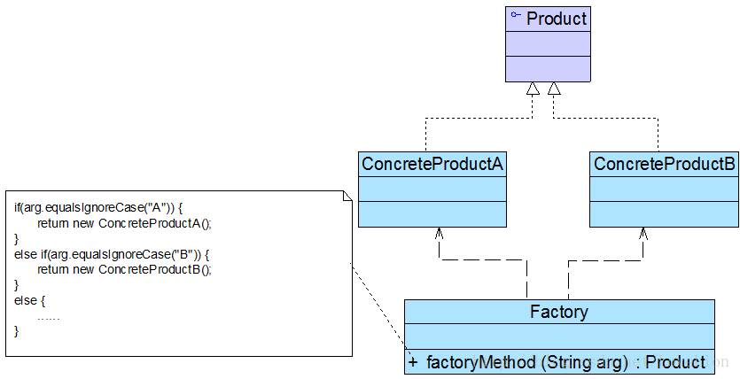

> 设计模式这一板块中的所有样例均来自程杰老师的《大话设计模式》（因为懒得自己想了），并且设计模式的定义也参zhao考chao本书。感谢程杰老师用通俗易懂的语言让自己快速了解了设计模式

> 所有图片来自 https://blog.csdn.net/LoveLion

# 简单工厂模式

> Simple Factory Pattern

简单工厂模式又叫做静态工厂模式，它是这样一个方法：根据传入的参数，返回不同的实例对象。通常情况下，这些返回的对象都是一个抽象类的子类。

## 优点

对类的实例化过程进行了抽象，将类的创建过程和业务流程分离出来，并且除去了客户端与具体产品的依赖

## 缺点

工厂方法集中了所有产品的创建，一旦工厂BOOM，整个系统都会受影响

不够灵活，每多一个具体产品，就要去修改一次工厂方法，违反开闭原则

# 工厂方法模式

> Factory Method，定义一个用于创建对象的接口，让子类决定实例化哪一个类。工厂方法使一个类的实例化延迟到其子类。

因为简单工厂方法每次修改都会违反开闭原则，并且如果客户端随便输一些非法输入也会很头疼（虽然并不会造成什么严重后果，返回个null倒霉的是客户端

使用工厂方法，客户端就根须需要的产品，选择具体的哪一个工厂。当有新的产品时，只需要新建一个对应的工厂类就ok了

## 优点

实例化产品的过程更加面向接口，客户端无需关心创建细节。
有新产品，修改的时候完全符合开闭原则。相对于简单工厂模式，可拓展性更高。

## 缺点

轮到客户端需要选择判断调用哪一个工厂了。。

# 抽象工厂模式

> AbstractFactory 提供一个创建一系列相关或互相依赖对象的接口，而无需指定它们具体的类。

抽象工厂模式为创建一组对象提供了一种解决方案。与工厂方法模式相比，抽象工厂模式中的具体工厂不只是创建一种产品，它负责创建一族产品。

## 优点

易于变换产品系列，并且很容易增加新的产品族

## 缺点

产品族增加新的产品很麻烦，要违反开闭原则