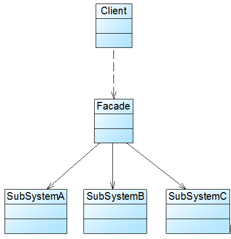

# 装饰模式

> Decorator Pattern 动态的给一个对象添加一些额外的职责，就增加功能来说，装饰模式比生成子类更为灵活

装饰模式很适合在对象需要额外添加功能时使用，并且这个功能的拓展不会影响到原来的对象

## 优点

比继承更加灵活，符合开闭原则。并且由于装饰模式中类的接口相同，可以动态的控制使用哪一些装饰类，实现不同功能

## 缺点

灵活 = 难debug

装饰模式有一个嵌套一个的性质，因此debug的时候难以定位到哪一层的装饰类出错

# 代理模式

> Proxy Pattern 为其他对象提供一种代理以控制对这个对象的访问

代理模式可以增强原对象的功能。也能够将被代理对象隐藏起来，不被外界直接访问到，在这之上进行诸如访问过滤、日志记录等一系列功能。代理模式隔开了客户端和被调用者。

Java的动态代理就是代理模式的一种实现。

## 优点

隔离调用者和被调用者，一定程度上降低了耦合

不同的代理类型可以做到许多不同的效果

## 缺点

?

# 外观模式

> Facade Pattern 为子系统中的一组接口提供一个一致的界面，此模式定义了一个高层接口，这个接口使得这一子系统更加容易使用

外观模式一大作用就是可以减少系统之间的耦合，同时可以控制系统间数据的隔离

Tomcat中就使用到了外观模式，保证了不同组件之间的数据能互相隔离

## 优点

屏蔽了子系统组件，使得互相之间要处理的东西变得更少

保证了各个系统之间的松耦合，若一个系统内部发生改变，不影响其他系统

## 缺点

？

# 适配器模式

> Adapter Pattern 将一个类的接口转换为客户希望的另外一个接口。Adapter模式使得原本由于接口不兼容而不能一起工作的那些类可以一起工作

有时候我们需要使用一些由外部提供的接口。但是现有系统无法兼容外部接口，我们又不能更改外部接口。这时候可以考虑使用适配器模式

适配器模式和代理模式有些像，都是通过一个类对另一个类进行包装。不过适配器模式这边，是把不兼容的接口包装起来，转换为兼容的接口

* Adaptee：需要适配的类

* Target；客户端所期待的接口

* Adapter：适配器

## 优点

适配器模式将客户端和目标类解耦。通过中间一个适配器，无需修改客户端和目标类

同时，适配者的灵活性和拓展性都极强

## 缺点

Java这种不支持多继承的语言，一次最多只能适配一个适配者
