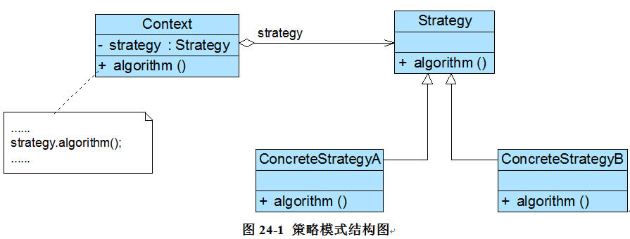
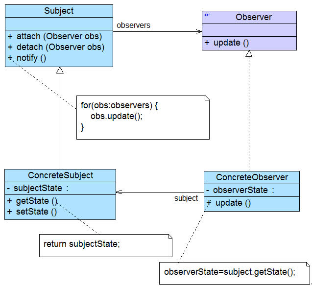

# 策略模式

> Strategy Pattern 它定义了算法家族，分别封装起来，让它们之间可以互相替换，此模式让算法的变化，不会影响到使用算法的客户

有点类似于工厂模式，它可以让一个类封装一种不同的算法。当需要不同的算法时，客户端只需要切换不同的实现即可。当算法本身有改动时，也只需要修改封装的类而不需要修改客户端。



## 优点

符合开闭原则，并且它将算法封装在类中，可以很好的实现复用

## 缺点

需要由客户决定使用哪一个策略类

# 模板方法模式

> Template Method Pattern 定义一个操作中的算法股价，而将一些步骤延迟到子类中。模板方法使得子类可以不改变一个算法的结构即可重定义该算法的某些特定步骤。

Java并发包中的AQS类就是典型的模板方法模式使用者。Spring的IOC容器实现中，也大量使用了模板方法模式


## 优点

这个模式可以让父类确保算法的整个流程和步骤，而让一些细节由子类实现，这样既可以保证算法或业务的完整性，又可以保证拓展性和动态性

可以实现一种反向控制结构，通过子类覆盖父类的钩子方法来决定某一特定步骤是否需要执行

## 缺点

每一个实现都需要提供一个子类。如果父类中可变的基本方法太多，将会导致类的个数增加，系统更加庞大

# 观察者模式

> Observer Pattern 定义了一种一对多的依赖关系。让多个观察者对象同时监听某一个主题对象。是这个主题对象在状态发生变化时，会通知所有观察者对象，使它们能够自动更新自己。

观察者模式又叫发布-订阅模式。被观察对象中维护了一个观察者的引用集合。当某些特定事件发生时，会通知所有观察者对象，使它们做出相应处理

观察者模式的应用非常的广泛。许多GUI语言的事件处理的实现使用了它，Tomcat的生命周期管理也使用了观察者模式



* Subject：目标/主题。指被观察的对象，它有一个观察者集合，同时还有一个通知方法

* ConcreteSubject：具体目标/主题。具体的被观察对象，通常有具体的实现或者具体的事件

* Observer：观察者。有一个对主题的引用。对主题发生的事件作出反应，有一个方法用于接收事件来更新自己

* ConcreteObserver：具体观察者。具体实现了事件发生后的响应

## Java中的观察者模式支持

Java提供了一个*Observer*接口和一个*Observable*类实现了对观察者模式的支持

#### Observable

*Observable*充当了目标类

源码有做删减↓↓↓

```java
public class Observable {
    private Vector<Observer> obs;

    public Observable() {
        obs = new Vector<>();
    }

    public synchronized void addObserver(Observer o) {
        if (o == null)
            throw new NullPointerException();
        if (!obs.contains(o)) {
            obs.addElement(o);
        }
    }

    public synchronized void deleteObserver(Observer o) {
        obs.removeElement(o);
    }

    public void notifyObservers() {
        notifyObservers(null);
    }

    public void notifyObservers(Object arg) {
        Object[] arrLocal;

        synchronized (this) {
            if (!changed)
                return;
            arrLocal = obs.toArray();
            clearChanged();
        }

        for (int i = arrLocal.length-1; i>=0; i--)
            ((Observer)arrLocal[i]).update(this, arg);
    }

    public synchronized void deleteObservers() {
        obs.removeAllElements();
    }
   
    public synchronized int countObservers() {
        return obs.size();
    }
}
```

可以看到*Observable*保存了一个*Observer*观察者的集合，同时提供了通知方法和对观察者的操作方法

#### Observer

*Observer*是一个观察者接口，需要用户自己实现

```java
public interface Observer {
    void update(Observable o, Object arg);
}
```

可以看到里面有一个*update(Observable o, Object arg)*方法用于接受通知

## 优点

观察者模式维持了一个稳定的一对多关系

观察者模式对主题和观察者进行了解耦。主题类只需要维持一个观察者的集合引用即可。在发生事件时，主题类也无需了解观察者类的细节，只需要通知即可

同时，因为互相面向的是接口，可以很方便的对主题和观察者进行修改。符合开闭原则

## 缺点

如果有很多观察者，通知所有的观察者可能会有很大时延

目标类和观察者类之间有互相引用，有可能造成循环调用

# 职责链模式

> Chain Of Responsibility Pattern 使多个对象都有机会处理请求，从而避免请求的发送者和接收者之间的耦合关系。将这个对象连成一条链，并沿着这条链传递该请求，直到有一个对象处理它为止。


* Handler：处理请求的接口

* ConcreteHandler：具体处理者类。处理请求时可访问它的后继者，如果可处理该请求就处理，否则将请求转发给后继者

## 优点

降低了请求发送者和处理者的耦合

同时，处理者只需保持一个向后的引用，不需要知道链的具体结构，这样增强了灵活性。可以随时给处理链增加、减少处理者

## 缺点

请求有可能得不到处理

链过长时会造成维护困难